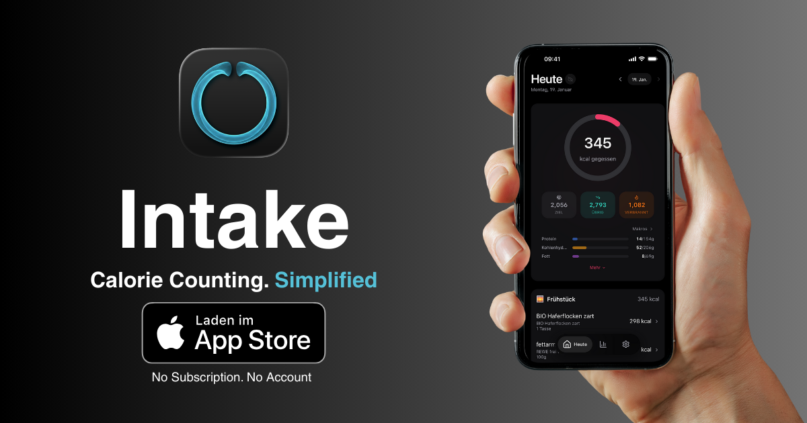

# Intake

Intake is a clean calorie and nutrition tracker focused on speed, clarity, and daily consistency.

Live landing page: [https://intake.tobibechtold.dev](https://intake.tobibechtold.dev)

<a href="https://apps.apple.com/us/app/intake-kalorienz%C3%A4hler/id6757768955">
  
</a>
<a href="https://play.google.com/store/apps/details?id=de.bechtoldit.intake">
  
</a>

## What's New authoring

Release entries live in `content/whats-new/<version>/` and are rendered into localized overview and detail pages.

Required files per release:
- `de.md`
- `en.md`
- `assets/` for screenshots and optional videos

Required frontmatter fields:
- `version`
- `publishedAt`
- `title`
- `summary`
- `coverImage`

Optional frontmatter fields:
- `video`
- `highlights`

Example:

```text
content/whats-new/2.1.1/
  de.md
  en.md
  assets/
    cover.svg
    search.png
    demo.mp4
```

Routes are generated automatically:
- English overview: `/whats-new`
- German overview: `/de/whats-new`
- English detail: `/whats-new/<version>`
- German detail: `/de/whats-new/<version>`

Prerendering and sitemap generation read the release content folder directly, so adding a new version entry is enough to publish a new localized page pair.
