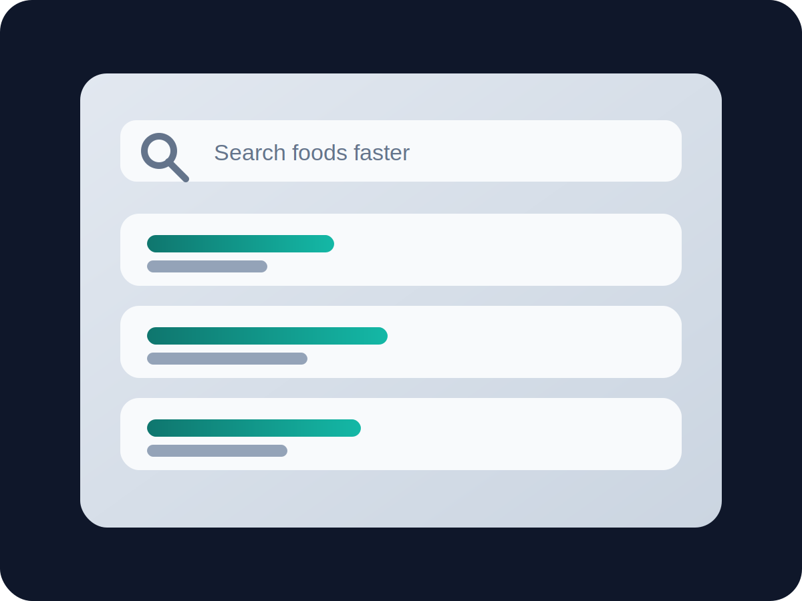

## Schneller erfassen

Die Suche reagiert schneller und macht das Hinzufugen von Lebensmitteln im Alltag spurbare einfacher.

## Bessere Statistiken

Die Statistikansicht zeigt wichtige Trends klarer und reduziert visuelles Rauschen.
