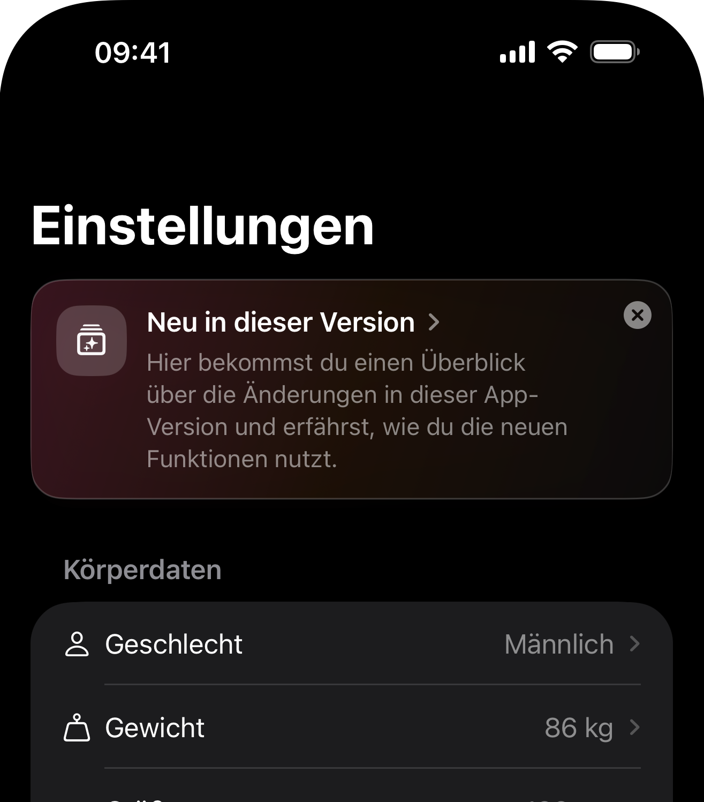

## More actions for meals

Tapping on a meal now does more than just show what you logged. You can now:
- share a meal, for example through AirDrop or WhatsApp
- copy a meal into any other meal
- create a recipe from everything in that meal

Open any meal and try the new actions.

## Redesigned calorie and macro goals

Calorie and macro goals have been completely redesigned to give you more ways to set your targets while still keeping things simple. Power users get full control, while everyone else still gets a straightforward setup.

You can now choose whether Intake calculates your calorie target for you or whether you want to enter your own TDEE manually. If you use calculated macros, you can still adjust your protein intake in grams per kilogram of body weight. You can also decide how your carbs and fats should be split. You can see the full overview in the video below.

## Faster and better search

Food search is now dramatically faster thanks to more compute power and more efficient backend search logic. Average search time has dropped from around 3 to 4 seconds to under one second.

Search results have also improved. Intake now prioritizes foods from the user's selected country more often, and search term matching should feel more accurate overall.

## New What's New section in settings

After each update, you'll find a button in settings that takes you to this page so you can quickly see what changed in the latest version.

## More flexible portion entry

Portion step sizes now use 0.25 increments. You can also tap directly on the amount, whether it's grams or portions, and enter exactly what you ate. There are no longer preset step restrictions limiting the value you can enter.

## Bug fixes

This update also includes a number of bug fixes based on reports from the Feature Voting Tool. Please keep the feedback coming. It helps improve Intake for everyone, and there is still plenty more to build.

Thank you for using Intake. I hope you're continuing to enjoy the app.

Tobi ❤️
