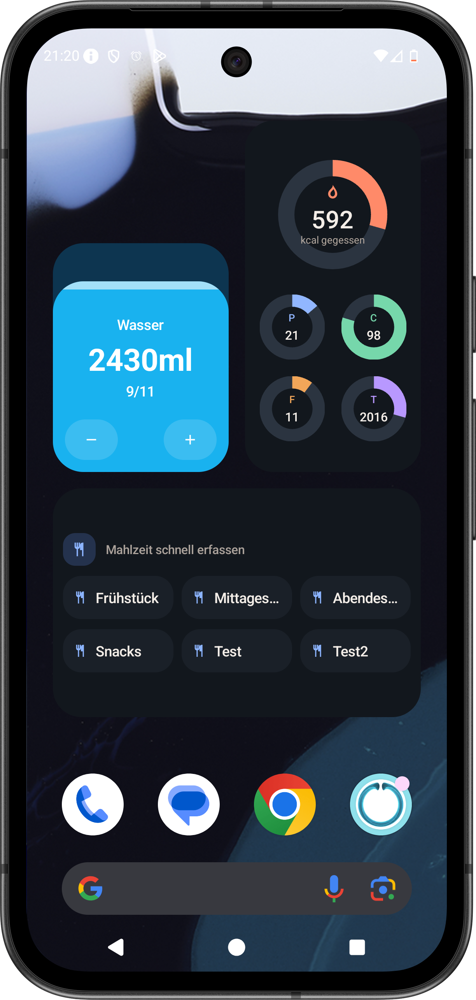

## More nutrients, vitamins, and minerals

Intake now supports the most common micro- and macronutrients, vitamins, and minerals, plus caffeine and taurine.

Not every product in the Open Food Facts database includes all of that data yet, so it is completely normal if some foods still show incomplete nutrition details. Products based on the German BLS database are fully filled out, which also makes things like caffeine tracking in your statistics possible.

The video below shows you exactly where to find all of the new nutrition data in the app.

## Intermittent fasting

One of the most requested features is finally here: intermittent fasting.

The feature is completely optional and only appears after you turn it on in settings. Once enabled, you will see a new fasting tab in the navigation where you can start and manage your fasting windows. You can also decide whether you want notifications and a Live Activity to keep your progress visible throughout the day.

## Live Activity on iPhone, live updates on Android

To go with intermittent fasting, Intake now shows your fasting progress as a Live Activity on iPhone and as a live notification on Android.

At the moment, this is used for fasting only.

## Android widgets

Android now gets proper home screen widgets as well.

Just long-press your home screen to add them. Depending on the widget size, you will see more or less information at a glance.

## Easier day switching on iPhone

The swipe gesture on the dashboard caused too many conflicts with scrolling, so I removed it for now.

Instead, there is now a simpler day selector at the top of the page. It is more reliable today, and I am still working on bringing back a smoother swipe experience later if I can do it without the old issues.

## More colors

You can now choose from even more accent colors in settings to make Intake feel a bit more personal.

## Completely redesigned statistics

After adding the new nutrients, the statistics section has been rebuilt from the ground up.

The overview now gives you cleaner summary cards for the current week, and each card opens into a detailed view with selectable time ranges and more in-depth data. You can also tailor the statistics much more closely to your own goals, whether you want to focus on caffeine, vitamin coverage, or something else entirely.

## Other improvements

- You can now edit recipe categories
- Android now supports custom workout durations
- Android now has quick-add buttons for favorites, history, and frequent foods
- There is now a small "About Intake" page in the app

## Bug fixes and improvements

As always, this release also includes a number of smaller fixes and improvements based on the issues you keep reporting.

You can find the full changelog [here](https://featurevoting.tobibechtold.dev/app/intake/changelog).

Thank you for using Intake. I hope you're continuing to enjoy the app.

Tobi ❤️
