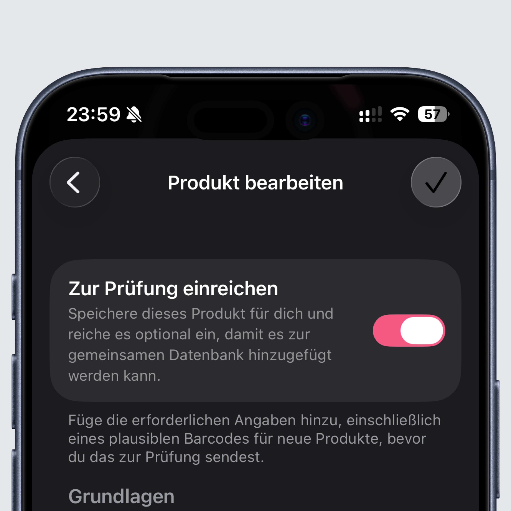
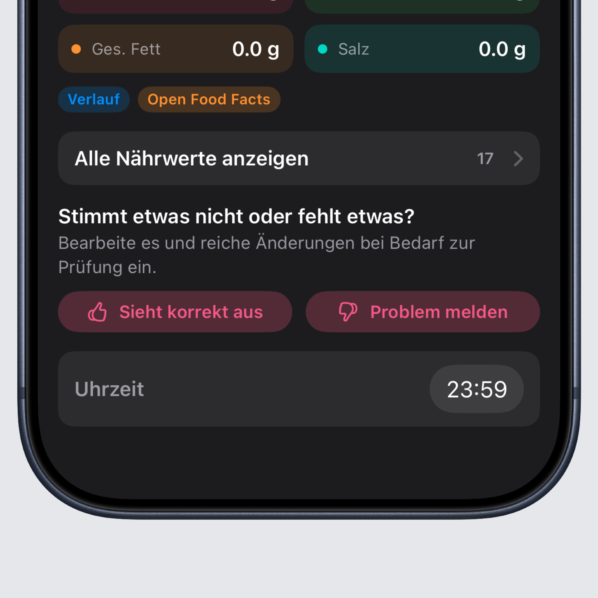
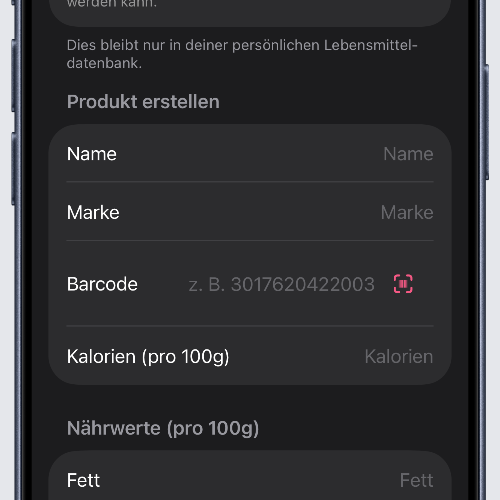

## Let's make the Intake database even better together

This is a big Intake release, and its main focus is giving you, as a user, a way to actively contribute to Intake.
A calorie tracker is only as good as its database. Thanks to the OpenFoodFacts database, Intake already has a large number
of products available, but some of those products are outdated, have incorrect nutrition values, are missing serving sizes,
or are not in the database at all.

Until now, you could already edit products yourself in these cases and adjust them locally on your device. That changes with
this version. From now on, you can submit your changes or new products for review and actively help make the Intake database
better step by step.

When I started Intake, I never thought we would reach more than 3,000 users in such a short time. Let's use that collective
knowledge together and build a database that can compete with the big players in the market.

You can also now give feedback on how good or bad a product's data is before you log it.

## Barcode scanning now works when creating and editing products

To make creating and editing products easier, you can now scan barcodes directly instead of typing them in by hand when you
want to submit a product for review. Just tap the barcode icon and your camera will open. If the product already exists in
the database, Intake will let you know and take you straight to that product.

## Favorites are now sorted alphabetically

Your favorites list is now sorted alphabetically, so you can find what you are looking for faster.

## Quick Add now takes the time of day into account (iOS)

When you tap the big plus button, Intake now preselects a fitting meal depending on the current time of day.

## Bug fixes and improvements

As always, this release also includes a number of fixes for issues you keep reporting. Keep them coming :)

You can find the full changelog [here](https://featurevoting.tobibechtold.dev/app/intake/changelog).

Thank you for using Intake. I hope you continue to enjoy the app.

Tobi ❤️
