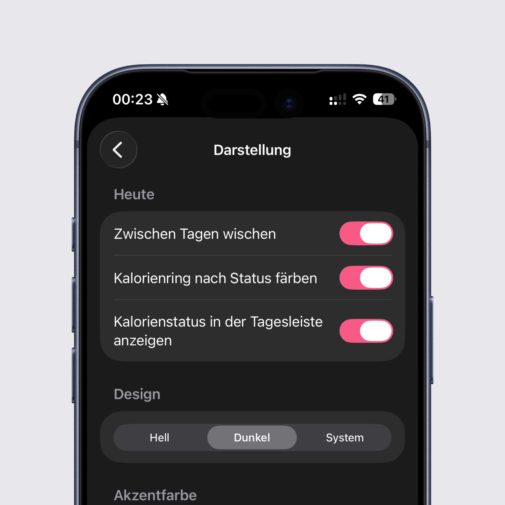

## Kalorienziel wird jetzt farblich dargestellt.

Die Farbe des Rings verändert sich ab sofort, je nachdem wie viele Kalorien ihr noch übrig habt oder über dem Ziel seid.
Innerhalb des Ziels bleibt der Ring grün, wenn ihr bis zu 10% über dem Ziel seid wird der Ring gelb, ansonsten rot. Diese Statusfarbe
wird auch in der Wochenübersicht dargestellt, damit ihr eine kleine Übersicht habt. Dieses Feature ist vollkommen optional, ihr könnt 
es jederzeit in den Einstellungen unter Darstellung wieder ausschalten.

## Verbesserungen in der Gewichtsstatistik

Die Statistik für das eingetragene Gewicht wurde überarbeitet und bietet jetzt eine bessere Lesbarkeit.

## Wochenübersicht für Android

Lange hat es gedauert, aber auch die Android App bekommt jetzt die beliebte Wochenübersicht am oberen Bildschirmrand. Somit könnt ihr schneller
durch eure Woche navigieren und habt zusätzlich eine kleine Übersicht über euer Kalorienziel.

## Produkte aus Häufig und Zuletzt entfernen

Ab sofort könnt ihr Produkte aus Häufig und Zuletzt entfernen, indem ihr euren Finger lange auf das Produkt haltet und dann "entfernen"
auswählt. Wenn ihr das Produkt in der Zukunft wieder benutzt kann es wieder in der Liste auftauchen.

## Swipen zum Tag wechseln wird optional

Beide Apps bieten jetzt die Möglichkeit das swipen zwischen Tagen zu deaktivieren. Das könnt ihr in den Einstellungen unter Darstellung tun.

## Nährwertübersicht

Gleiche Produkte werden in der Nährwertübersicht jetzt zusammengefasst.

## Bugfixes und Verbesserungen

Wie immer wurden einige Fehler in der App behoben, die ihr wie immer fleißig meldet. Weiter so :)

Unter anderem wurde das Limit für Häufig und Zuletzt auf 100 Produkte erhöht. Somit habt ihr da mehr Platz für eure Lieblingsprodukte.

Das komplette Changelog findet ihr wie immer [hier](https://featurevoting.tobibechtold.dev/app/intake/changelog).

Vielen Dank das ihr Intake nutzt, ich hoffe ihr habt weiterhin Freude an der App.

Euer Tobi ❤️
