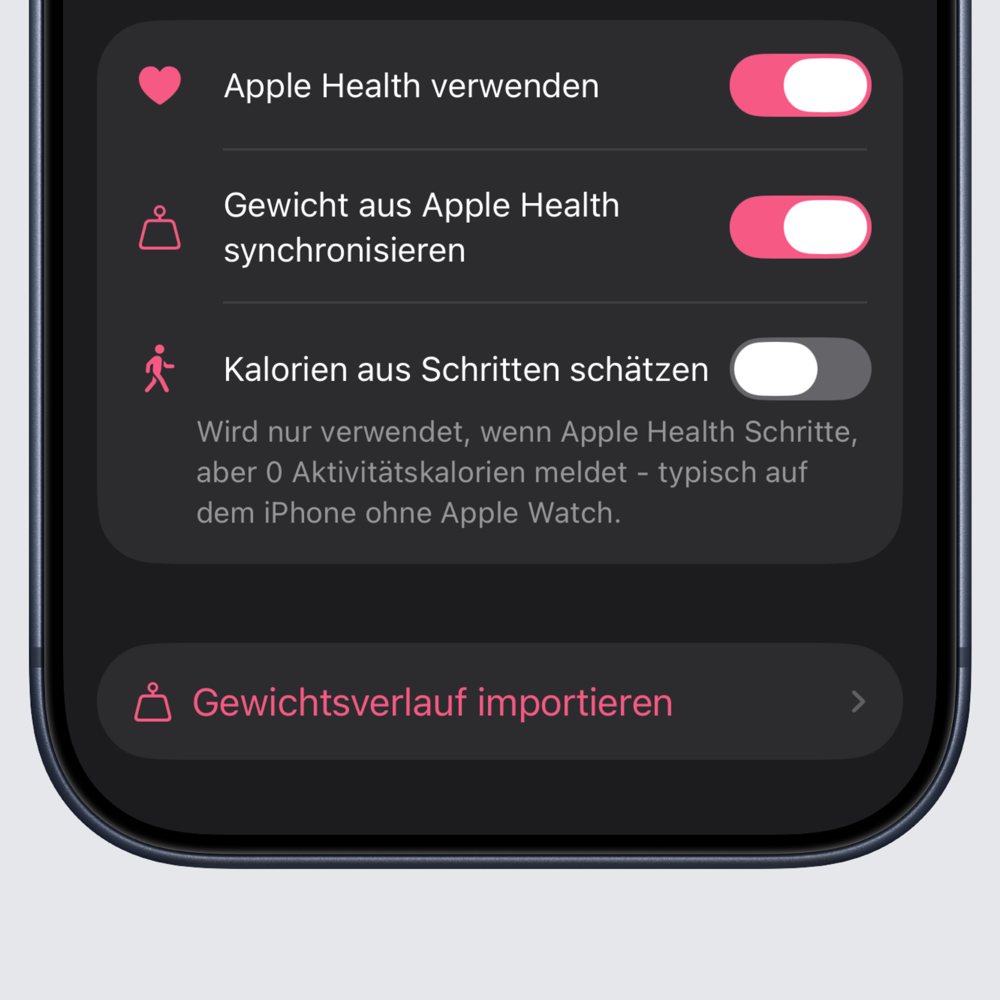

## Tag kann jetzt geteilt werden

Intake kann jetzt Social Media optimierte Bilder für euere Stories oder Posts erstellen, damit ihr nicht immer einen 
Screenshot machen müsst. Damit habt ihr eure Werte für den aktuellen Tag übersichtlich aufbereitet.

## Mahlzeiten und Makros bleiben aufgeklappt

Mahlzeiten und Makros bleiben jetzt auf- oder zugeklappt auch über App-Neustarts hinaus.

## Rezepte kopieren/duplizieren

Ihr könnt jetzt Rezepte auch duplizieren. Einfach auf das Rezept tippen und oben Duplizieren auswählen. Dann wird eine
exakte Kopie des Rezepts erstellt, die ihr direkt bearbeiten könnt. Das Rezept wird erst erstellt, wenn ihr auch auf Speichern 
drückt. Zum Duplizieren könnt ihr auch in der Übersicht lange auf ein Rezept tippen.

## Schritte in Kalorien umrechnen

Diese Einstellung ist für Nutzer gedacht, die Schritte ohne eine Smart Watch nur mithilfe ihres Smartphones tracken. Oftmals werden
dabei nur die Schritte gespeichert, diese aber nicht in Kalorien umgerechnet. Diese Einstellung solltet ihr also nur aktivieren, 
wenn ihr feststellt, dass eure Schritte nicht in euer Kalorienziel zählen. Bei der Benutzung einer Smart Watch ist dies allerdings meistens schon der Fall. 
Prüft das bitte vorher, um etwaige Doppelzählungen zu vermeiden.

## Bugfixes und Verbesserungen

Wie immer wurden einige Fehler in der App behoben, die ihr wie immer fleißig meldet. Weiter so :)

Unter anderem wurde ein Fehler behoben, der zu Abstürzen der App führen konnte. Außerdem wurde ein Bug im Verlauf und den Favoriten behoben und die Performance der App verbessert.

Das komplette Changelog findet ihr wie immer [hier](https://featurevoting.tobibechtold.dev/app/intake/changelog).

Vielen Dank das ihr Intake nutzt, ich hoffe ihr habt weiterhin Freude an der App.

Euer Tobi ❤️
