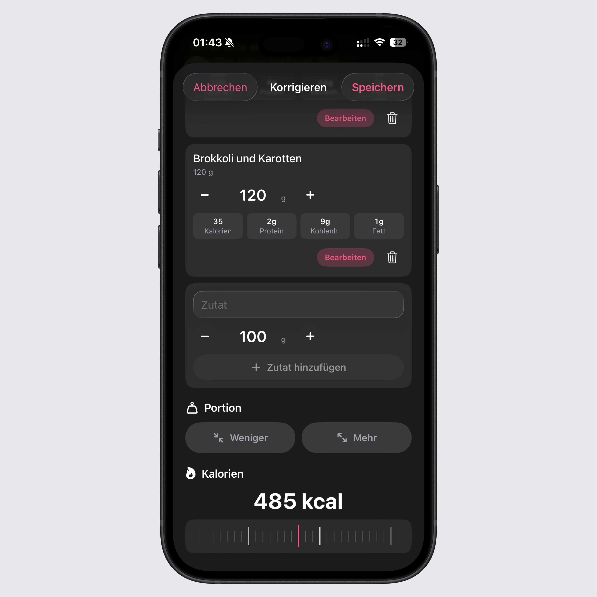

## Mehr Kontrolle über Intake AI

Intake AI kann jetzt besser mit Schätzungen umgehen, die aus mehreren Zutaten bestehen.

Du entscheidest beim Speichern, ob daraus ein gemeinsamer Mahlzeiteneintrag werden soll oder ob Intake jede Zutat einzeln ins Tagebuch übernimmt. So bleibt ein einfaches Gericht kompakt, während du bei detaillierteren Schätzungen trotzdem jede einzelne Zutat sauber nachbearbeiten kannst.

## Korrekturen ohne Umwege

Wenn eine KI-Schätzung nicht ganz passt, musst du nicht mehr von vorn anfangen.

Du kannst Zutaten hinzufügen, entfernen oder umbenennen und Mengen direkt ändern. Auch die Portion lässt sich nachträglich größer oder kleiner setzen. Wenn du schon weißt, wie viele Kalorien die Mahlzeit ungefähr haben sollte, kannst du den Kalorienwert jetzt ebenfalls manuell korrigieren.

## Getränke werden besser erkannt

Intake AI erkennt Getränke jetzt automatisch und behandelt sie passend.

Taucht in einer Schätzung Wasser, Kaffee, Saft, ein Shake oder ein anderes Getränk auf, wird der Eintrag als Getränk markiert und die Menge in ml angezeigt. Das passt besser zu deinem restlichen Tracking und spart Nacharbeit.

## Wieder schneller bei vielen eigenen Lebensmitteln

Außerdem steckt in diesem Update viel Arbeit an der Performance.

Vor allem große lokale Lebensmitteldatenbanken konnten die App zuletzt spürbar ausbremsen. Wir haben mehrere Engpässe gefunden und optimiert, damit Suchen, Loggen und Arbeiten mit gespeicherten Lebensmitteln wieder deutlich schneller reagieren.

Das komplette Changelog findest du wie immer [hier](https://featurevoting.tobibechtold.dev/app/intake/changelog).

Vielen Dank, dass du Intake nutzt. Ich hoffe, dir gefällt das neue Release.

Tobi
