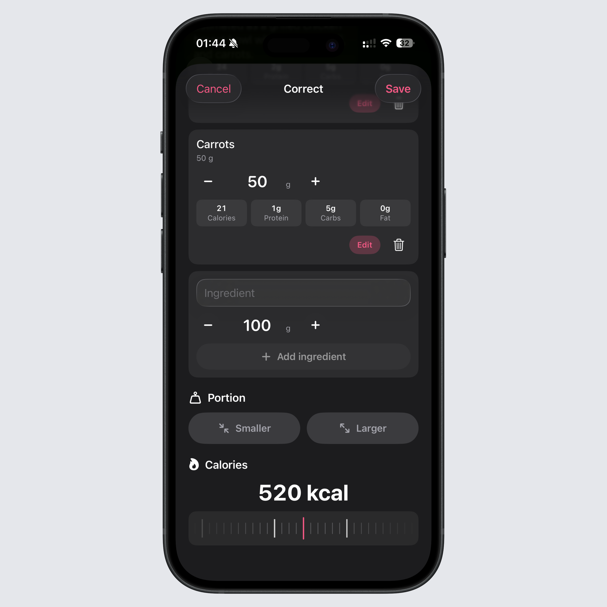

## Smarter Intake AI estimates

Intake AI just got more flexible, especially when an estimate contains several ingredients.

You can now choose whether you want to log an estimate as one meal or save each ingredient separately. Use one meal when you want a clean diary entry, or split the ingredients when you want more control over the details.

## Better editing before you save

AI estimates are still suggestions, and this update gives you more ways to correct them before they reach your diary.

You can add missing ingredients, remove anything that does not belong, edit an ingredient name, and adjust the amount. You can also tell Intake AI to use a larger or smaller portion, or manually set the calories you think the meal should have.

## Beverages in the right place

Intake AI now recognizes beverages automatically.

When a drink appears in an estimate, Intake marks it correctly and shows the amount in ml, so water, coffee, juice, shakes, and similar entries fit better into the rest of your tracking.

## Faster with large local databases

This release also includes a lot of performance work throughout the app.

We found and fixed several bottlenecks that could slow things down when you had a large local food database. Intake should feel fast again while searching, logging, and working with your saved foods.

You can find the full changelog [here](https://featurevoting.tobibechtold.dev/app/intake/changelog).

Thank you for using Intake. I hope you enjoy the new release.

Tobi
