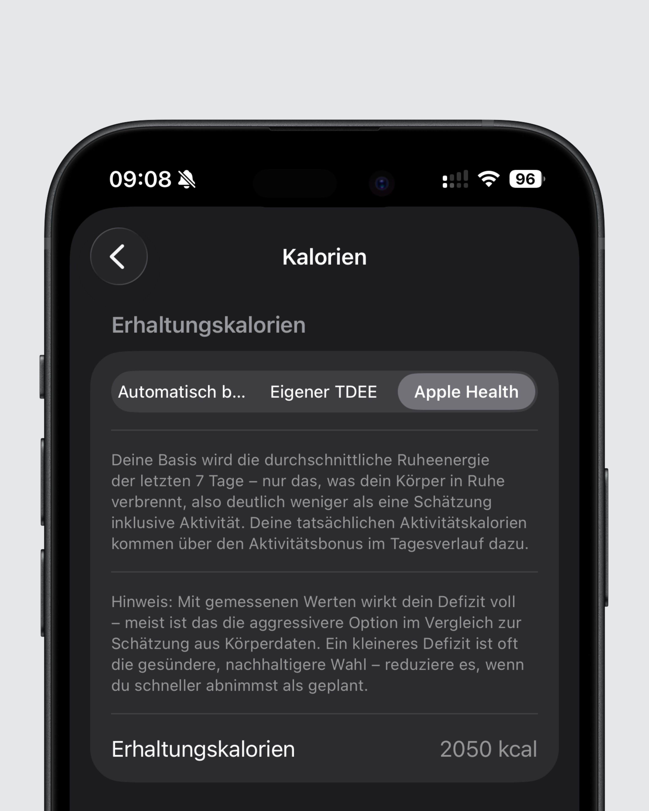
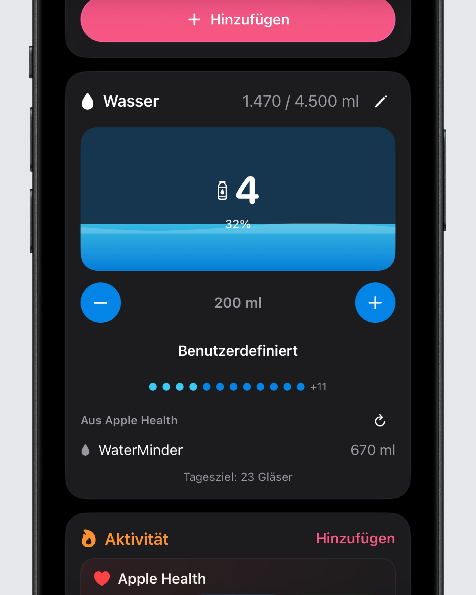

## Schnellere Arbeit mit Mahlzeiten

Intake 2.4.4 macht wiederkehrende Mahlzeiten einfacher.

Wenn du eine Mahlzeit kopierst, ist jetzt standardmäßig das heutige Datum vorausgewählt. Das spart einen Schritt, wenn du häufig ähnliche Mahlzeiten an mehreren Tagen trackst. Außerdem kannst du eine komplette Mahlzeit jetzt direkt über das Drei-Punkte-Menü löschen, ohne jeden Eintrag einzeln entfernen zu müssen.

## Apple Health als Basis für dein Kalorienziel

Auf iOS kann Intake dein Kalorienziel jetzt auch auf Basis der von Apple Health berechneten Ruhekalorien setzen.

Bisher hat Intake dein Ziel entweder aus deinen Körperdaten und deinem Aktivitätslevel berechnet oder deinen selbst festgelegten TDEE verwendet. Mit diesem Update kannst du stattdessen die Ruhekalorien aus Apple Health als Grundlage nutzen. Das sind die Kalorien, die dein Körper ohne zusätzliche Aktivität verbrennt.

Wichtig: Dadurch kann dein Ziel zunächst niedriger wirken, weil Aktivitätskalorien darin nicht enthalten sind. Sie werden erst im Laufe des Tages ergänzt, wenn Intake deine Aktivitätsdaten bekommt. Wenn du diese Option nutzt, solltest du deshalb die Einstellung zum Hinzufügen von Aktivitätskalorien zum Ziel aktiviert lassen.

Wasserdaten aus Apple Health können ebenfalls gelesen werden, wenn du das in den Einstellungen aktivierst. Zusätzlich wurden mehrere Health-Probleme korrigiert: Gewichtseinträge lassen sich wieder löschen, Aktivitätskalorien vom Vortag fehlen nicht mehr, und Aktivitätsdaten sollten sich nicht mehr plötzlich auf 0 zurücksetzen.

Auf Android wurde die Health Connect Integration weiter verbessert. Außerdem bringen Wischgesten den Kalorienverbrauch nicht mehr durcheinander.

## Glatter im Alltag

Auch in diesem Update wurden einige Bugs, die ihr gemeldet habt beseitigt.

Das komplette Changelog findest du wie immer [hier](https://featurevoting.tobibechtold.dev/app/intake/changelog).

Vielen Dank, dass du Intake nutzt. Ich hoffe, dir gefällt das neue Release.

Tobi
