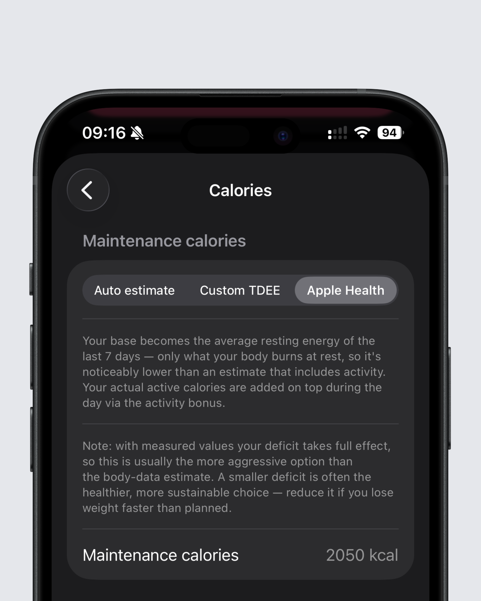
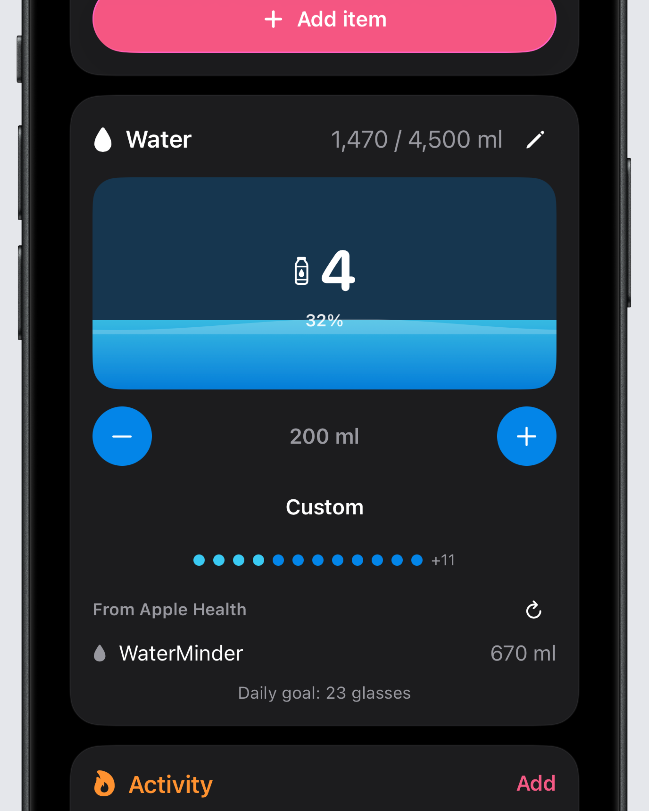

## Faster meal actions

Intake 2.4.5 makes repeated meals easier to manage.

When you copy a meal, today's date is now selected by default. That saves a step when you often track similar meals across multiple days. You can also delete an entire meal directly from the three-dot menu instead of removing every item one by one.

## Apple Health as your calorie target base

On iOS, Intake can now use the resting calories calculated by Apple Health as the base for your calorie target.

Until now, Intake calculated your target from your body data and activity level, or used the custom TDEE you entered yourself. With this update, you can use Apple Health resting calories instead. These are the calories your body burns without additional activity.

Important: this can make your target look lower at first because activity calories are not included in that base. They are added throughout the day as Intake receives your activity data. If you use this option, you should keep the setting that adds activity calories to your target enabled.

Water data from Apple Health can also be read when you enable it in settings. This release fixes several Health-related issues too: weight entries can be deleted again, yesterday's activity calories no longer go missing, and activity data should no longer unexpectedly reset to 0.

On Android, the Health Connect integration has been improved further. Swipe gestures also no longer mix up calorie burn values.

## Smoother day-to-day use

This update also removes several small but noticeable interruptions.

You can find the full changelog [here](https://featurevoting.tobibechtold.dev/app/intake/changelog).

Thank you for using Intake. I hope you enjoy the new release.

Tobi
