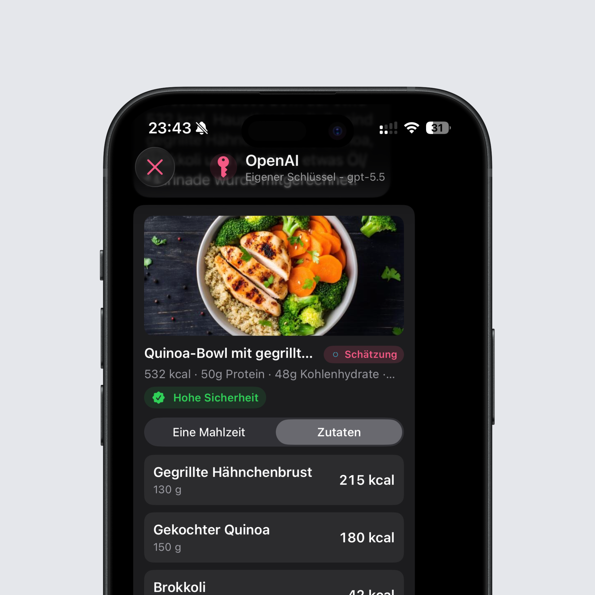
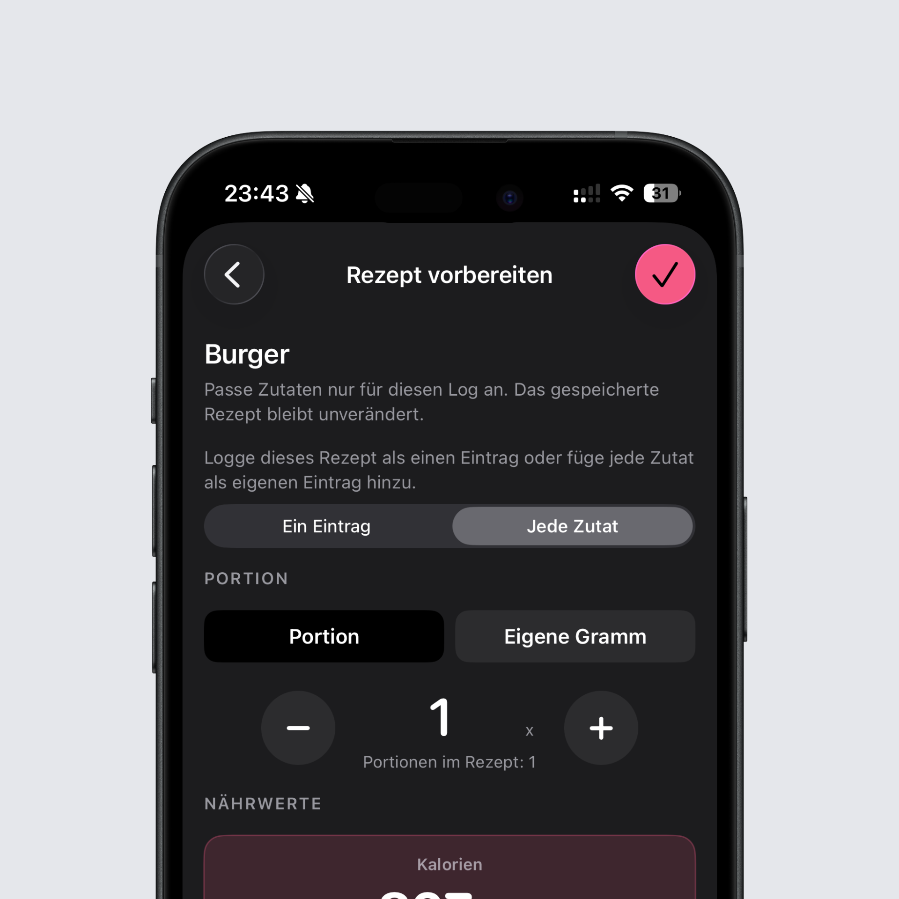

## Zutaten einzeln loggen mit BYOK

BYOK zerlegt ein Foto oder einen Text jetzt auch in die einzelnen Zutaten. Danach entscheidest du selbst, genau wie in Intake AI, ob du die Schätzung als ein Produkt loggen möchtest oder jede Zutat für sich.

Das lohnt sich vor allem, wenn eine Schätzung nicht ganz passt: Loggst du die Zutaten einzeln, kannst du sie im Nachhinein gramgenau anpassen. War vom Reis mehr auf dem Teller und vom Hähnchen weniger, korrigierst du einfach die beiden Werte, statt die ganze Mahlzeit neu zu schätzen.

## Rezepte flexibler eintragen

Auch beim Loggen eines Rezepts hast du jetzt die Wahl. Entweder landet es als ein Rezept in deinem Tag, oder jede Zutat wird einzeln eingetragen. So bleibt ein Rezept übersichtlich, wenn du es wie gespeichert gekocht hast, und du behältst die volle Kontrolle über jede Zutat, wenn du beim Kochen etwas weggelassen oder mehr genommen hast.

## Rezepte sortieren

Auf der Rezeptseite kannst du deine Rezepte jetzt nach Name, Änderungsdatum oder Kalorien pro Portion sortieren. Je größer deine Sammlung wird, desto schneller findest du damit genau das Rezept, das du gerade suchst.

## Lange Namen vollständig sichtbar

Lange Namen werden nicht mehr abgeschnitten, sondern vollständig angezeigt. Du erkennst dadurch auf einen Blick, welcher Eintrag gemeint ist, und musst bei ähnlichen Produkten nicht mehr raten.

## Bessere Prompts und klarere Fehler bei BYOK

Alle BYOK-Prompts wurden überarbeitet, wodurch die Schätzungen verlässlicher ausfallen. Außerdem geht Intake jetzt deutlich besser mit Fehlern der Anbieter um. Statt einer allgemeinen Fehlermeldung siehst du, was genau schiefgelaufen ist. Und wenn es am Modell liegt, kannst du direkt im Chat auf ein anderes Modell wechseln, ohne von vorne anfangen zu müssen.

Das komplette Changelog findest du wie immer [hier](https://featurevoting.tobibechtold.dev/app/intake/changelog).

Vielen Dank, dass du Intake nutzt. Ich hoffe, dir gefällt das neue Release.

Tobi
