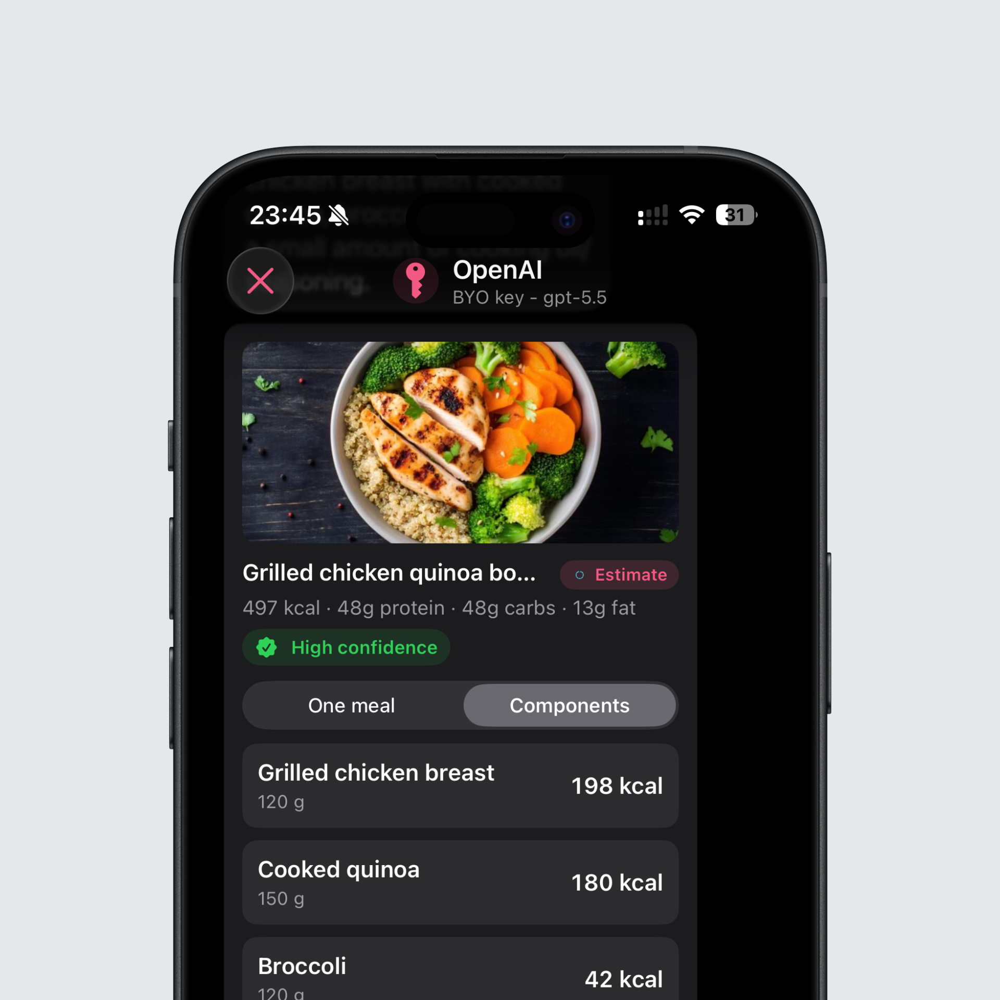
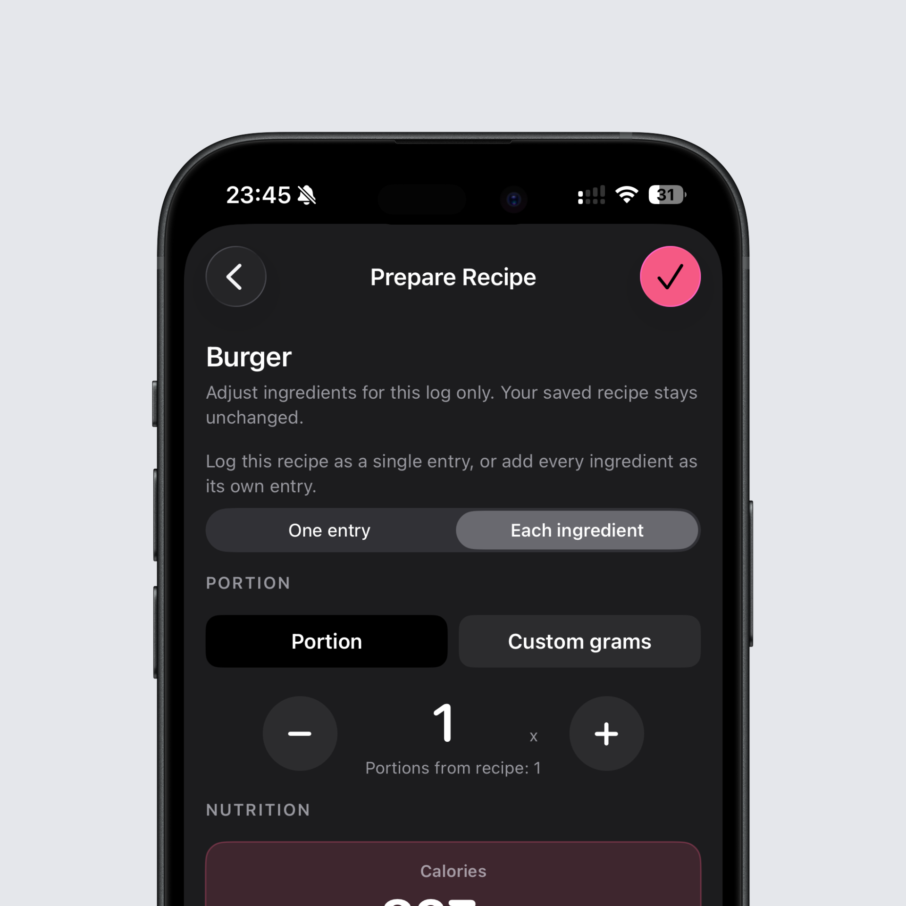

## Log individual ingredients with BYOK

BYOK can now break a photo or a text down into its individual ingredients. After that, you decide, exactly like in Intake AI, whether you want to log the estimate as one product or each ingredient on its own.

This pays off whenever an estimate isn't quite right. If you log the ingredients individually, you can adjust them gram by gram afterwards. More rice on the plate and less chicken? Just correct those two values instead of re-estimating the entire meal.

## More flexibility when logging recipes

Logging a recipe now gives you the same choice. It either goes into your day as a single recipe, or every ingredient is logged separately. That keeps a recipe tidy when you cooked it exactly as saved, and gives you full control over each ingredient when you left something out or used more of it.

## Sort your recipes

On the recipe page, you can now sort your recipes by name, date modified, or calories per portion. The bigger your collection gets, the faster you'll find the exact recipe you're looking for.

## Long names fully visible

Long names are no longer truncated and are shown in full. You can tell at a glance which entry you're looking at, without having to guess between similar products.

## Better prompts and clearer errors in BYOK

All BYOK prompts have been reworked, which makes estimates more reliable. Intake also handles errors from the providers far better now. Instead of a generic error message, you can see what exactly went wrong. And if the model is the problem, you can switch to a different one right inside the chat without starting over.

You can find the full changelog [here](https://featurevoting.tobibechtold.dev/app/intake/changelog).

Thank you for using Intake. I hope you enjoy the new release.

Tobi
