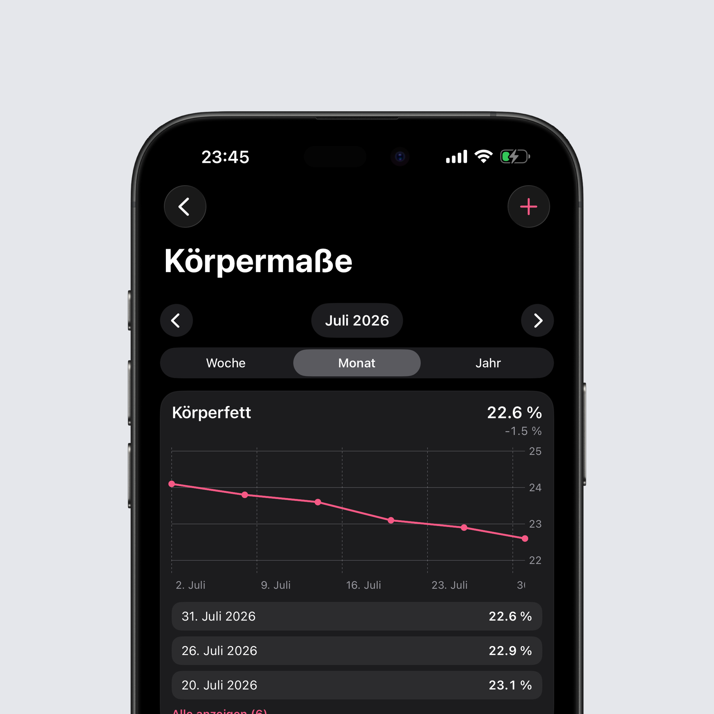
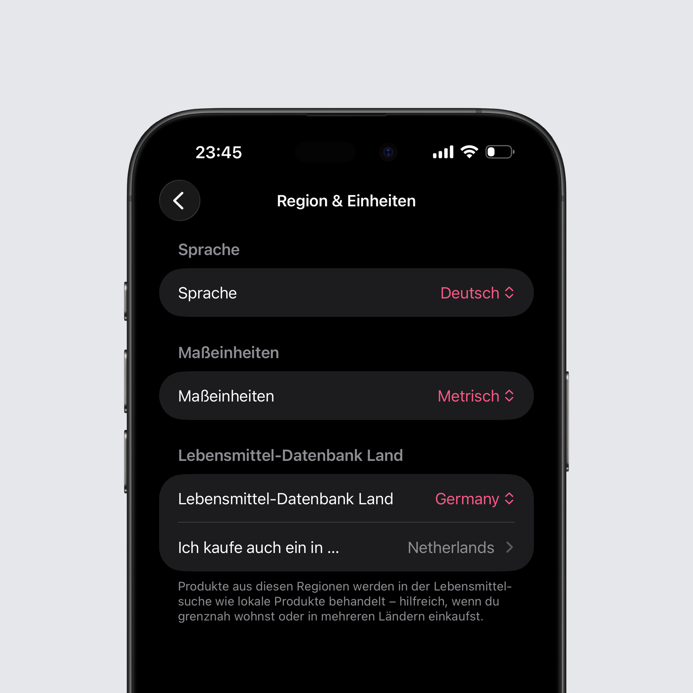

## Körpermaße

Die größte Neuerung dieses Updates ist eine neue Körpermaße-Karte in deiner Statistik. Du kannst Taille, Hüfte, Brust, Oberschenkel, Arm- und Halsumfang sowie Körperfett erfassen, metrisch oder imperial.

Jedes Maß, das du trackst, bekommt seine eigene Karte mit Diagramm: mit aktuellem Wert, der Veränderung im gewählten Zeitraum und allen Einträgen dieses Zeitraums. Tippe auf einen Punkt im Diagramm, um Wert und Datum zu sehen, oder halte einen Eintrag gedrückt, um ihn zu löschen. Die Karten kannst du außerdem per Drag-and-drop selbst sortieren, damit die Maße, die dich am meisten interessieren, oben stehen.

Wenn du deine Werte auf der Heute-Seite haben möchtest, gibt es dafür eine optionale Karte mit aktuellem Wert, Trend pro Maß und Schnell-Eintrag. Taillenumfang und Körperfett synchronisieren in beide Richtungen mit Apple Health, dadurch erscheint Körperfett von der smarten Waage automatisch, und alles, was du selbst einträgst, synchronisiert über iCloud zwischen deinen Geräten.

Auf Android synchronisiert Körperfett in beide Richtungen mit Health Connect, ein Wert von deiner smarten Waage landet also in Intake und jeder Wert, den du einträgst, wird zurückgeschrieben. Gelöschte Werte bleiben auch gelöscht, selbst wenn der Eintrag einer anderen App gehört und Intake ihn in Health Connect gar nicht entfernen darf. Alle Maße sind Teil deines Backups und ziehen so mit auf ein neues Handy um.

Denkt dran eure Apple Health oder HealthConnect Berechtigungen in den Einstellungen zu erneuern.

## Eine Suche, die weiß, wo du einkaufst

Unter Region & Einheiten kannst du jetzt weitere Länder festlegen, in denen du einkaufst. Produkte von dort werden wie lokale behandelt, was hilft, wenn du nah an einer Grenze wohnst oder regelmäßig im Ausland einkaufst. Auch das gewählte Land der Lebensmittel-Datenbank beeinflusst endlich wirklich die Sortierung, sodass Produkte aus deiner Umgebung zuerst stehen.

Die Suche selbst ist zudem deutlich fehlertoleranter geworden. Tippfehler und Etiketten-Schreibweisen führen nicht mehr zu leeren Ergebnissen, „griechischer Johgurt" oder „Skyr 0,2 % Fett" finden jetzt die richtigen Produkte.

## Intake AI Portionen

Schätzungen mit Zutatenaufschlüsselung kennen jetzt ihr Gesamtgewicht. Es steht direkt unter der Portionsangabe, und du kannst den Eintrag von dort aus in Gramm anpassen.

Das Skalieren einer Schätzung läuft jetzt über einen einzigen Regler, unter iOS von 0,5× bis 5× und unter Android von 0,25× bis 4×. Er skaliert die komplette Mahlzeit oder alle Zutaten auf einmal, statt dass du Werte einzeln anpassen musst, und er steht auch beim Loggen als ganze Mahlzeit zur Verfügung, nicht nur bei einzelnen Zutaten.

## Rezepte

Auf Android kannst du einem Rezept jetzt das fertige Gewicht des gekochten Gerichts mitgeben. Bisher hat Intake einfach die rohen Zutaten addiert und damit ignoriert, wie viel Wasser ein Gericht beim Kochen verliert oder aufnimmt – aus einem Geschnetzelten, das am Ende 700 g wiegt, wurden so 1.100 g. Trägst du das echte Endgewicht ein, hat es Vorrang vor der Zutatensumme, und das Loggen nach Gramm passt endlich zu dem, was im Topf war. Beim Duplizieren bleibt das Gewicht erhalten, genauso in Backups und geteilten Rezepten.

Auch der System-Zurück-Button und die Zurück-Geste verhalten sich beim Anlegen eines Rezepts jetzt richtig. Wer den Zutaten-Picker oder den Barcode-Scanner verlässt, verliert nicht mehr das komplette Rezept samt aller bereits erfassten Zutaten, sondern geht nur einen Schritt zurück – und beim Verlassen eines Rezepts mit ungesicherten Änderungen fragt Intake vorher nach. Und wenn Android Intake zwischendurch aus dem Speicher wirft, ist deine Zutatenliste beim Zurückkommen noch da.

## Apple Health

Einstellungen → Apple Health liest jetzt den letzten Monat an Aktivität, Workouts und Wasser mit einem Tipp neu ein. Wenn du auf mehreren Geräten trackst, musst du dafür nicht länger jeden einzelnen Tag öffnen.

## Health Connect

Schritte außerhalb einer Aktivität zählen wieder mit. Bisher reichte ein einziger Eintrag mit aktiven Kalorien, damit Intake für den Rest des Tages nur noch mit der Aktivität rechnete – eine kurze Trainingseinheit am Abend konnte damit alles auslöschen, was du tagsüber gelaufen bist. Diese Schritte werden jetzt zusätzlich zu deinen echten aktiven Kalorien gutgeschrieben, während Schritte während einer aufgezeichneten Aktivität weiterhin außen vor bleiben, damit nichts doppelt zählt.

Auch Löschungen kommen jetzt in Health Connect an. Entfernst du eine Mahlzeit, wird der Tag in Health Connect neu geschrieben, statt dass der alte Eintrag dort bis zu deinem nächsten Log stehen bleibt. Und was nicht durchkommt – etwa nach einer entzogenen Berechtigung oder einem Rate-Limit –, verschwindet nicht mehr still, sondern wird gemerkt und nachgeholt, sobald du die Heute-Seite öffnest oder etwas einträgst – und sofort, wenn du den Aktualisieren-Button auf der Aktivitätskarte oder „Jetzt synchronisieren“ in den Einstellungen antippst.

Und die Synchronisierung holt vergangene Tage nach. War Intake nach wiederholten Health-Connect-Fehlern in den reduzierten Sync-Modus gefallen, blieb es dort und synchronisierte nur noch den heutigen Tag. Jetzt wird die normale Synchronisierung einmal pro Tag erneut versucht, im reduzierten Modus werden die letzten sieben Tage abgedeckt, und der Zustand steht sichtbar in der Health-Connect-Diagnose.

## Fehlerbehebungen

- Dasselbe Produkt taucht in der Lebensmittelsuche nicht mehr mehrfach auf, Duplikate werden zum besten Eintrag zusammengefasst
- Das Gewicht behält überall seine zwei Nachkommastellen: aus 61,95 kg von Apple Health oder deiner Eingabe wird nicht mehr 62,0 kg, und auch die Tipp-Anzeige im Gewichtsdiagramm behält sie
- Eiweiß, Kohlenhydrate und Fett werden mit Zehntelgramm angezeigt, genau wie auf dem Etikett – aus 12,6 g Eiweiß eines Eis wird nicht mehr 13 g
- Das Entfernen eines Favoriten gilt dauerhaft, Favoriten schleichen sich nicht mehr über die iCloud-Synchronisierung zurück
- Aus der Häufig-Liste entfernte Einträge bleiben draußen, auch wenn du das Lebensmittel weiterhin loggst
- Beim Blättern in vergangene Monate steht nicht mehr „Aktuell"
- Tiefst- und Höchstgewicht im Jahresüberblick nutzen deine echten Tageswerte statt Monatszusammenfassungen
- Die Zeitraum-Auswahl in der Statistik blättert nicht mehr in die Zukunft
- Apple Health Daten, die verspätet ankommen, etwa von deiner Apple Watch oder einer anderen App, werden jetzt automatisch für die letzten Tage nachgetragen statt nur für heute
- Die Statistik vergleicht deinen Durchschnitt mit dem Ziel, das an jedem Tag wirklich galt, inklusive Tages-Anpassungen und Aktivität, statt mit dem festen Wert aus deinem Profil
- Produkte mit eigener Portionsgröße lassen sich direkt im Portions-Bildschirm als Favorit markieren
- Das Anlegen oder Bearbeiten einer Portionsgröße trackt nicht mehr von selbst 100 g, und eine fehlgeschlagene Übermittlung loggt nicht mehr trotzdem das ungespeicherte Produkt
- Auf Android rechnet die Kalorien-Karte in der Statistik-Übersicht jetzt die Aktivität aus Health Connect mit ein, so wie es die Detailansicht schon getan hat

Das komplette Changelog findest du wie immer [hier](https://featurevoting.tobibechtold.dev/app/intake/changelog).

Vielen Dank, dass du Intake nutzt. Ich hoffe, dir gefällt das neue Release.

Tobi
