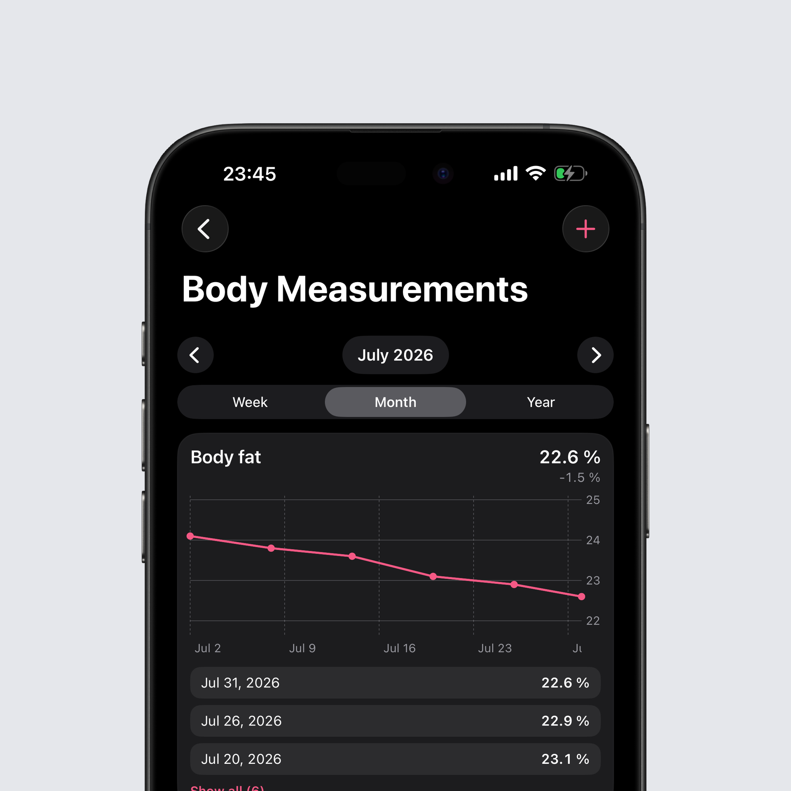
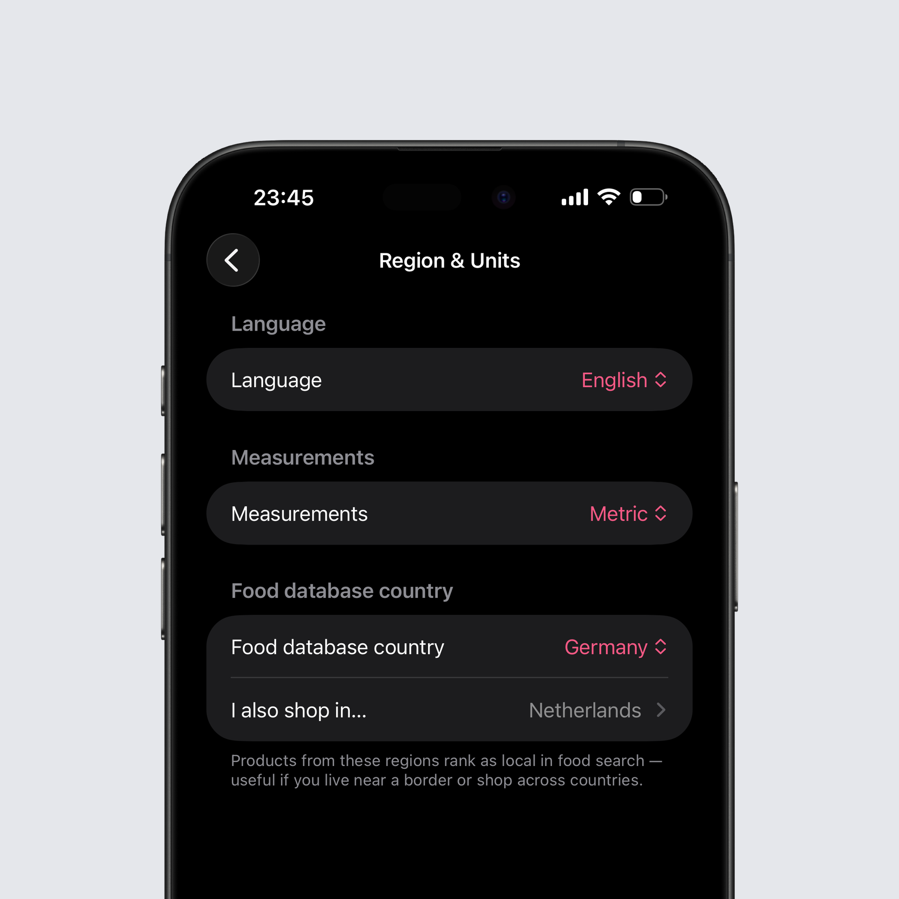

## Body measurements

The biggest addition in this update is a new body measurement card in your statistics. You can log waist, hip, chest, thigh, upper arm, and neck circumference plus body fat, in metric or imperial units.

Every measurement you track gets its own card and chart, showing the latest value, the change over the selected period, and that period's entries. Tap a point in a chart to see its value and date, or long-press an entry to delete it. You can also reorder the cards yourself with a drag-and-drop sheet, so the measurements that matter most to you sit on top.

If you want your numbers on the Today page, there is an optional card for it with the latest value, a trend per measurement, and a quick-add button. Waist circumference and body fat sync with Apple Health in both directions, so body fat from a smart scale shows up automatically, and everything you enter yourself syncs across your devices via iCloud.

On Android, body fat syncs with Health Connect in both directions, so a reading from your smart scale lands in Intake and every value you enter is written back. Deleting a value makes it disappear for good, even when the record belongs to another app and Health Connect won't let Intake remove it. All measurements are included in your backup, so they move with you to a new phone.

Be sure to renew your HealthConnect and Apple Health permissions in the settings.

## A food search that knows where you shop

Region & Units now lets you pick additional countries you shop in. Products from there rank just like local ones, which helps if you live close to a border or regularly buy abroad. The food database country you choose finally shapes the ranking too, so products sold where you live come first.

The search itself also got a lot more forgiving. Typos and label notation no longer lead to empty results, so "greek yoghurt" with a typo or "skyr 0.2% fat" now find the right products.

## Intake AI portions

Estimates with an ingredient breakdown now carry their total weight. It shows up right under the portion stepper, and you can adjust the entry in grams from there.

Scaling an estimate is a single control now, from 0.5× to 5× on iOS and 0.25× to 4× on Android. It scales the full meal or every ingredient at once instead of making you edit values one by one, and it is available when logging a whole meal as well, not just single ingredients.

## Recipes

On Android, a recipe can now carry the finished weight of the cooked dish. Until now Intake added up the raw ingredients, which ignores the water a dish loses or takes on in the pan — a stir-fry that ends up at 700 g was tracked as 1,100 g. Enter what the finished dish actually weighs and that value wins over the ingredient sum, so logging a recipe by grams finally matches what came out of the pot. The finished weight is kept when you duplicate a recipe, and it travels with backups and shared recipes.

The system back button and gesture behave properly while building a recipe, too. Leaving the ingredient picker or the barcode scanner no longer throws away the entire draft with every ingredient you had already added; you go back one step, and closing a recipe with unsaved changes asks first. And if Android reclaims Intake in the background halfway through, your ingredient list is still there when you return.

## Apple Health

Settings → Apple Health can now re-import the last month of activity, workouts, and water in one tap. If you track on more than one device, you no longer have to open every single day to get your data in.

## Health Connect

Steps you take outside a workout count again. Until now, a single active-calorie record was enough to make Intake switch to activity-only accounting for the rest of the day, so a short evening session could wipe out everything you had walked before it. Those steps are now credited on top of your real active calories, while steps recorded during a tracked activity stay out of the calculation so nothing is counted twice.

Deletions reach Health Connect now as well. Removing a meal rewrites that day in Health Connect instead of leaving the old entry sitting there until your next log. And a write that doesn't get through — a revoked permission, a rate limit — is remembered instead of being silently dropped: Intake retries it the next time you open the Today page or log something, and right away when you tap the refresh button on the activity card or Sync now in the settings.

Syncing also catches up on past days. If Intake had fallen back to its reduced sync mode after repeated Health Connect errors, it stayed there and only ever synced today. It now retries the regular sync once a day, covers the last seven days as long as it is degraded, and shows that state in the Health Connect diagnostics.

## Bug fixes

- The same product no longer shows up several times in food search; duplicates are collapsed into the best entry
- Weight keeps its two decimals everywhere: 61.95 kg from Apple Health or your keyboard no longer turns into 62.0 kg, and the weight chart's tap label keeps them too
- Protein, carbs, and fat show tenths of a gram, exactly as printed on the label — an egg's 12.6 g of protein no longer rounds up to 13 g
- Removing a favorite sticks; favorites no longer sneak back in through iCloud sync
- Entries removed from the Frequent list stay removed, even if you keep logging that food
- Browsing a past month no longer claims to show your "current" weight
- Lowest and highest weight in the year view use your real daily values instead of monthly summaries
- The statistics period picker no longer pages into the future
- Apple Health data that arrives late, from your Apple Watch or another app, is now picked up for the last few days automatically instead of only for today
- Statistics compare your average against the target that actually applied on each day, including day-based adjustments and activity, instead of the fixed value from your profile
- Products with a custom portion size can be marked as a favorite right from the portion screen
- Creating or editing a portion size no longer logs 100 g on its own, and a submission that fails no longer logs the unsaved product anyway
- On Android, the calorie card in the statistics overview now credits Health Connect activity, just like the detailed view already did

You can find the full changelog [here](https://featurevoting.tobibechtold.dev/app/intake/changelog).

Thank you for using Intake. I hope you enjoy the new release.

Tobi
