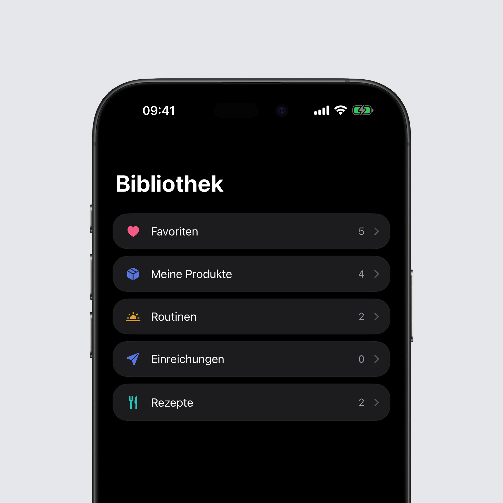
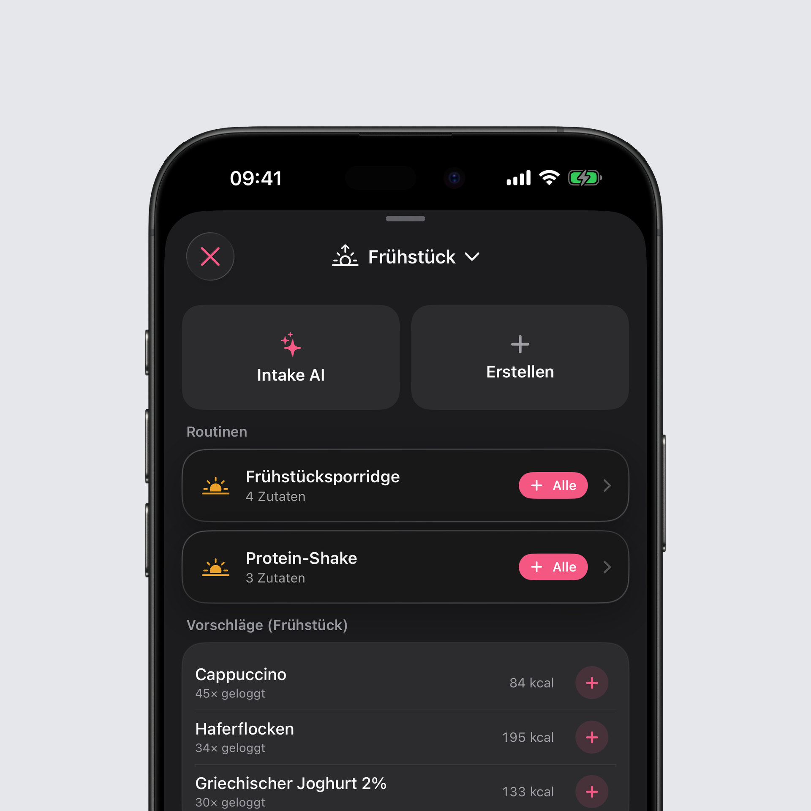
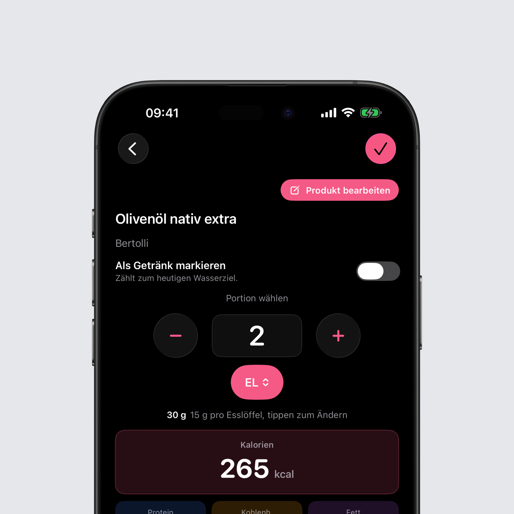

## Aus Rezepte wird Bibliothek

Der Tab Rezepte heißt jetzt Bibliothek, und er enthält alles, was dir gehört: Favoriten, eigene Produkte, Rezepte, Routinen und die Korrekturen, die du eingereicht hast. Bisher lagen diese Listen an verschiedenen Stellen der App, jetzt liegen sie nebeneinander in einem Tab.

Die Suche unten durchsucht alle Listen auf einmal. Du tippst den Namen eines Lebensmittels ein und musst nicht mehr wissen, ob es ein Favorit, ein eigenes Produkt oder eine Zutat in einem Rezept ist.

Jedes Lebensmittel kannst du mit eigenen Schlagworten versehen, zum Beispiel „Frühstück“ oder „Proteinreich“, und jede Liste danach filtern, in der Bibliothek und beim Hinzufügen. Jede Liste lässt sich außerdem sortieren, alphabetisch oder danach, wie oft du etwas loggst. Und ein Produkt löschen oder einen Favoriten entfernen geht jetzt direkt dort, wo du ihn siehst, ohne den richtigen Bildschirm zu suchen.

## Essen hinzufügen, neu gedacht

Der Bildschirm zum Hinzufügen ist komplett neu aufgebaut. Die Tab-Leiste oben ist weg, und der Bildschirm beginnt mit dem, was du zu dieser Mahlzeit wahrscheinlich isst.

### Vorschläge für diese Mahlzeit

Ganz oben stehen Vorschläge, die pro Mahlzeit gezählt werden statt über den ganzen Tag. Das Frühstück schlägt also Frühstück vor, das Abendessen Abendessen. Bei jedem Vorschlag steht, wie oft du ihn schon geloggt hast, und ein Tippen auf das Plus fügt ihn hinzu.

### Routinen

Gib einem Rezept eine feste Mahlzeit, und es wird zur Routine. Sie wartet oben bei dieser Mahlzeit und trägt mit einem Tippen jede Zutat einzeln ein. Dein Frühstücksporridge ist damit ein Tippen statt fünf.

### Eine Kamera für alles

Die Kamera füllt jetzt den ganzen Bildschirm. Unten wechselst du zwischen Barcode scannen und Essen scannen mit Intake AI, der Blitz sitzt da, wo dein Daumen ist. Vom Kamera-Widget und aus dem Intake AI Chat landest du direkt in derselben Kamera.

### Die Suche sitzt unten

Die Lebensmittelsuche ist nach unten gewandert, wo dein Daumen sie erreicht. Dein Suchbegriff bleibt stehen, wenn du ein Ergebnis öffnest und zurückkommst, und Scannen, Erstellen und Intake AI sind vom ersten Bildschirm aus je ein Tippen entfernt.

## Löffel, Tassen und Gläser

Gramm ist nicht mehr die einzige Wahl. Bei jedem Lebensmittel kannst du die Menge in Teelöffeln, Esslöffeln, Tassen, Gläsern oder Millilitern eingeben, direkt im Feld für die eigene Menge.

Egal welche Einheit du wählst, die Gramm dazu stehen immer direkt darunter, damit du weißt, was wirklich geloggt wird. Wechselst du die Einheit, rechnet Intake den Wert um und rundet auf das, was in dieser Einheit üblich ist: aus 100 g werden 7 Esslöffel, nicht 6,67.

Ein Esslöffel Öl wiegt nicht so viel wie ein Esslöffel Wasser. Tippe auf das Gewicht, korrigiere es einmal, und Intake merkt es sich für dieses Lebensmittel. Ein Eintrag, den du mit zwei Esslöffeln geloggt hast, öffnet sich später auch wieder mit zwei Esslöffeln, nicht mit 30 g.

## Fehlerbehebungen

- Dasselbe Lebensmittel, auf zwei Wegen geloggt, tauchte bisher zweimal in deinen Listen auf, jeweils mit der halben Anzahl. Es wird jetzt als ein Lebensmittel erkannt, damit die Häufig-Liste und die neuen Vorschläge richtig zählen.

Das komplette Changelog findest du wie immer [hier](https://featurevoting.tobibechtold.dev/app/intake/changelog).

Vielen Dank, dass du Intake nutzt. Ich hoffe, dir gefällt das neue Release.

Tobi
