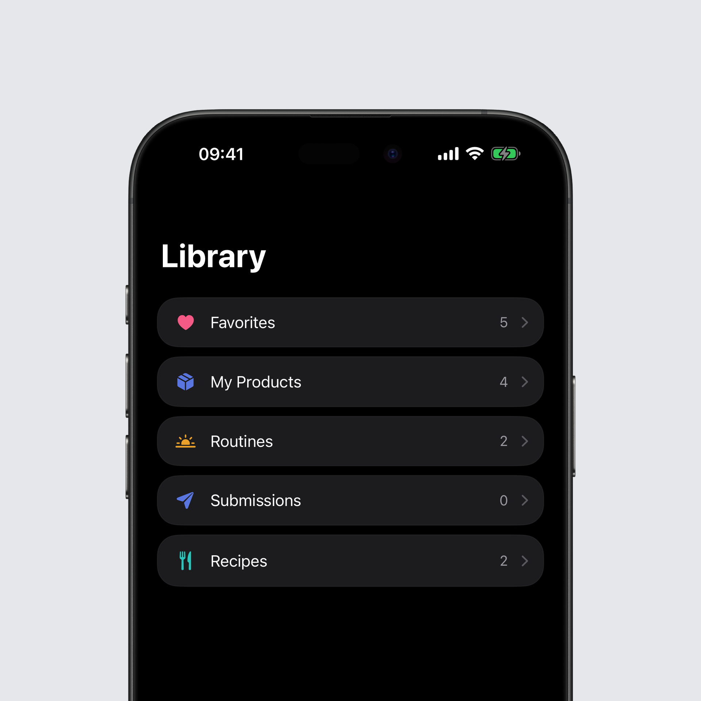
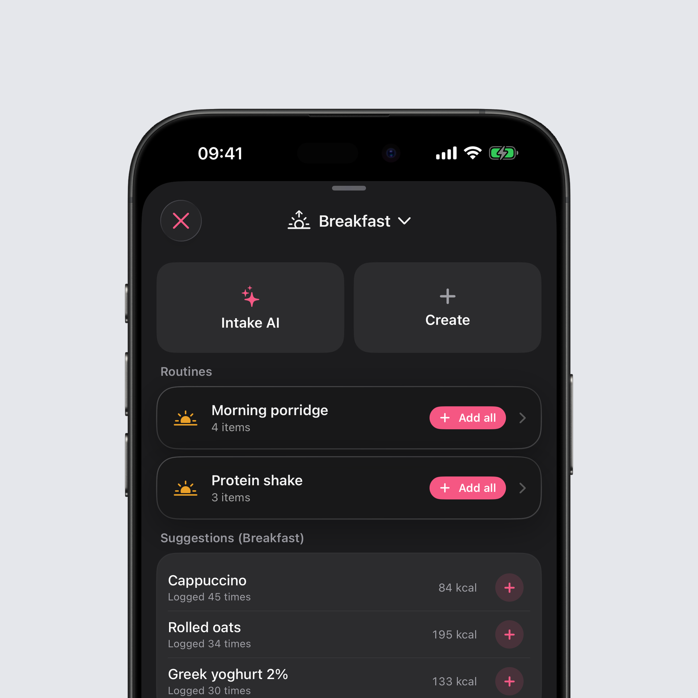
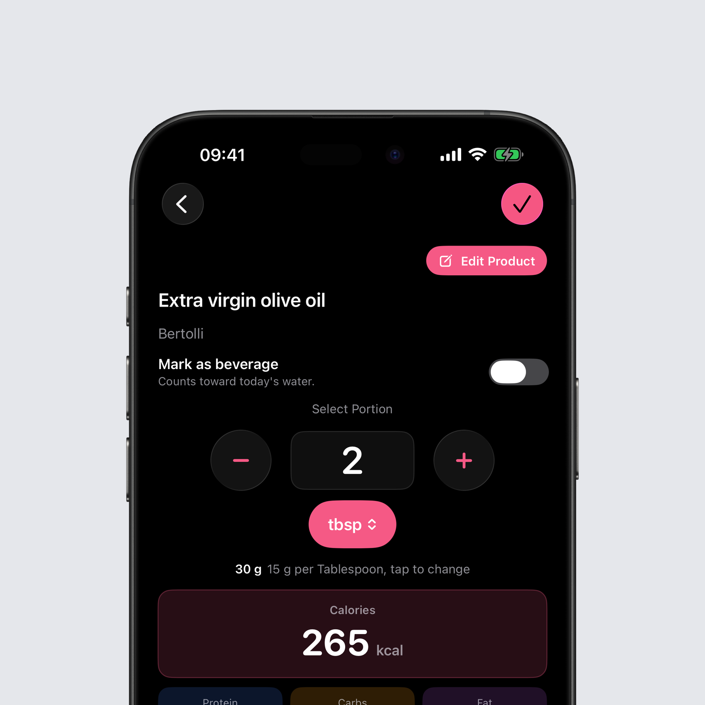

## Recipes is now Library

The Recipes tab is now called Library, and it holds everything that is yours: favourites, your own products, recipes, routines and the corrections you have submitted. Those lists used to live in different corners of the app, now they sit side by side in one tab.

The search at the bottom looks through all the lists at once. You type the name of a food and no longer need to know whether it is a favourite, one of your own products or an ingredient in a recipe.

You can give any food your own tags, say "Breakfast" or "High protein", and filter every list by them, both in the Library and while adding food. Every list can also be sorted, alphabetically or by how often you log something. And deleting a product or removing a favourite now happens right where you see it, without hunting for the right screen.

## Adding food, rethought

The add food screen has been rebuilt from the ground up. The row of tabs at the top is gone, and the screen starts with what you are most likely to eat at this meal.

### Suggestions for this meal

At the very top are suggestions counted per meal rather than across the whole day. Breakfast suggests breakfast, dinner suggests dinner. Each one says how often you have logged it, and a tap on the plus adds it.

### Routines

Give a recipe a fixed meal and it becomes a routine. It waits at the top of that meal and logs every ingredient as its own entry in one tap. Your morning porridge is now one tap instead of five.

### One camera for everything

The camera fills the whole screen now. At the bottom you switch between scanning a barcode and Meal Scan with Intake AI, and the flash sits where your thumb is. The camera widget and the Intake AI chat both open this same camera.

### Search sits at the bottom

Food search has moved to the bottom of the screen, within reach of your thumb. Your search term stays put when you open a result and come back, and scanning, creating and Intake AI are each one tap away from the first screen.

## Spoons, cups and glasses

Grams are no longer the only option. For any food you can enter the amount in teaspoons, tablespoons, cups, glasses or millilitres, right in the custom amount field. With imperial units selected in settings, the field counts in ounces and offers fluid ounces instead of millilitres.

Whatever unit you pick, the grams it comes to are always shown right underneath, so you know what actually gets logged. Switching units converts the value and rounds it to what that unit is counted in: 100 g becomes 7 tablespoons, not 6.67.

A tablespoon of oil does not weigh what a tablespoon of water does. Tap the weight, correct it once, and Intake remembers it for that food. An entry you logged as two tablespoons opens again as two tablespoons later, not as 30 g.

## Bug fixes

- The same food logged in two different ways used to show up twice in your lists, each with half the count. It is now recognised as one food, so the frequent list and the new suggestions count properly.

You can find the full changelog [here](https://featurevoting.tobibechtold.dev/app/intake/changelog).

Thank you for using Intake. I hope you enjoy the new release.

Tobi
