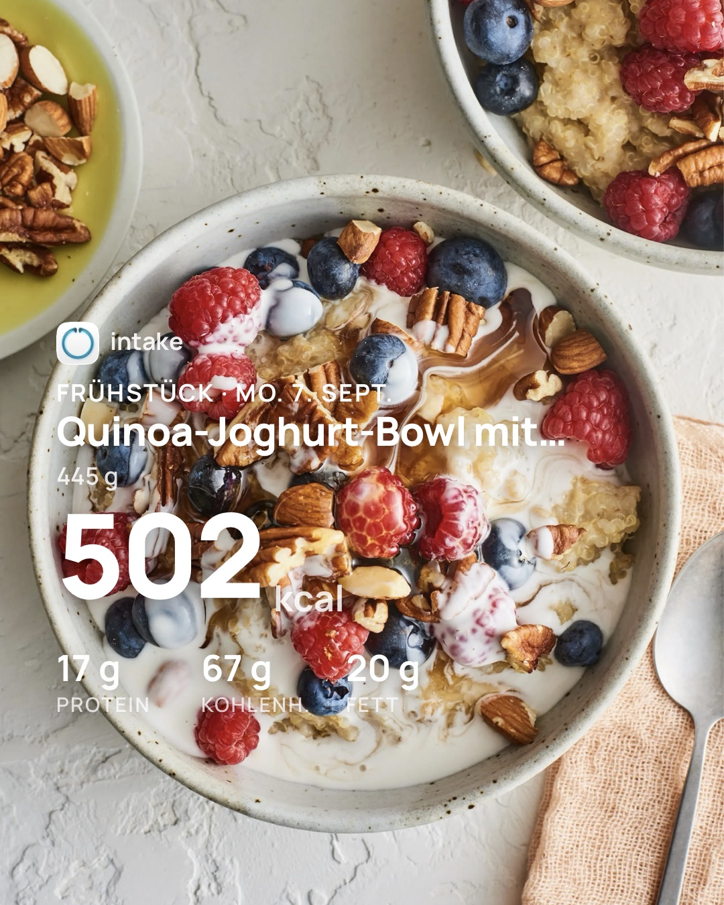

## Teile, was du isst

**Ein Ort zum Teilen.** Der Bild-Button beim Tag, bei einer Mahlzeit, einem Lebensmittel, einer Intake AI-Schätzung oder einem Körpermaß öffnet dasselbe Blatt. Wähle, was du teilst, dann die Karte.

**Story-Sticker, auf deinem Foto.** Jede Karte gibt es als transparente Version für deine Instagram-Story und als 4:5-Version für Karussells auf Instagram und TikTok. Wähle oder mache das Foto in Intake, der Sticker landet darauf. Eine Intake AI-Fotoschätzung bringt dein Essensfoto gleich mit.

**Tag, Mahlzeit oder Lebensmittel.** Der ganze Tag mit Ziel und verbrannten Kalorien, eine Mahlzeit mit ihren Lebensmitteln oder ein einzelnes Lebensmittel, als 4:5-Bilder. Dasselbe Bild auf iPhone und Android.

**Dein Trend, eine Zahl.** Teile, wie sich dein Gewicht oder ein anderes Körpermaß in der letzten Woche, im letzten Monat, in drei Monaten oder im Jahr verändert hat, als eine große Zahl und eine Linie.

## Einfachere Einreichungen

Die beiden Apps verlangten Unterschiedliches, bevor ein Produkt zur Prüfung gehen konnte: iOS gar keine Nährwerte, Android alle acht. Beides passte nicht zu dem, was die Prüfung tatsächlich bewertet. Jetzt gilt in beiden eine Regel: Ein neues Produkt braucht einen Namen, eine Marke, einen Barcode oder die Markierung „ohne Barcode“ sowie Kalorien, Fett, Kohlenhydrate und Protein pro 100 g. Null ist ein Wert, ein leeres Feld nicht. Alles andere ist optional. Eine Korrektur an einem gemeinsamen Produkt braucht einen Namen, eine Marke, sofern das gemeinsame Produkt eine hatte, und mindestens eine sichtbare Änderung; Nährwerte verlangt sie nie. Das Formular sagt dir Feld für Feld, was noch fehlt.

## Abgeschlossene Prüfungen

Bibliothek › Einreichungen hat einen neuen Abschnitt „Abgeschlossene Prüfungen“. Er listet jede entschiedene Prüfung, neueste zuerst, mit dem Ergebnis, dem Datum der Entscheidung und bei einer Ablehnung mit der Begründung der Prüfung. Offene Einreichungen bleiben oben. Ein Tipp auf eine abgeschlossene Prüfung tut nichts; sie ist ein Protokoll, kein Weg zurück ins Produkt.

## Der Scanner startet schneller

Die Kameravorschau hielt die App beim Start des Barcode-Scanners etwa eine Sekunde lang an. Jetzt wird sie angelegt, bevor die Kamera konfiguriert wird, und der Scanner steht sofort.

## Fehlerbehebungen

### iOS

- Ein zur Prüfung eingereichtes Produkt konnte tagelang als in Prüfung stehen, obwohl es abgelehnt war. Das Ergebnis erreichte das Produkt nie, weil seine ID unter Beachtung der Groß- und Kleinschreibung verglichen wurde. Jetzt kommt es an.
- Einreichungen aktualisieren sich beim Öffnen, wenn die letzte Abfrage älter als fünf Minuten ist, und jederzeit beim Herunterziehen der Liste. Kann der Status nicht abgefragt werden, sagt die Liste das, statt so zu tun, als hätte sich nichts geändert.
- Ein abgelehntes Produkt behält die Begründung der Prüfung und zeigt sie unter „Begründung“.
- Die Zeile Einreichungen in der Bibliothek zählt nur noch, was noch in Prüfung ist. Sechs abgeschlossene Prüfungen sahen bisher aus wie sechs offene.
- Das Kalenderband konnte um ein paar Tage verschoben erscheinen, sodass die Woche mitten in der Woche begann, und nach einem Besuch der Einstellungen weiter wandern. Jetzt landet es jedes Mal auf der aktuellen Woche und rückt sich selbst zurecht.

### Android

- Ein zur Prüfung eingereichtes Produkt konnte für immer als in Prüfung stehen bleiben. Die App meldete sich bei jedem Start als neuer anonymer Nutzer beim Katalog an und sah deshalb nicht mehr, was ihr früheres Ich eingereicht hatte. Sie behält ihre Identität jetzt, und das Ergebnis kommt an. Produkte, die vor diesem Update eingereicht wurden, gehören zu Identitäten, die die App nicht mehr hat, und bleiben als in Prüfung stehen; reiche sie erneut ein, wenn du sie noch prüfen lassen willst.
- Einreichungen aktualisieren sich beim Öffnen, wenn die letzte Abfrage älter als fünf Minuten ist, und jederzeit beim Herunterziehen der Liste, auch wenn sie leer ist. Kann der Status nicht abgefragt werden, sagt die Liste das, statt so zu tun, als hätte sich nichts geändert.
- Ein abgelehntes Produkt behält die Begründung der Prüfung und zeigt sie unter „Begründung“. Die Begründung ist Teil deines Google-Drive-Backups.

Das komplette Changelog findest du wie immer [hier](https://featurevoting.tobibechtold.dev/app/intake/changelog).

Vielen Dank, dass du Intake nutzt.

Tobi
