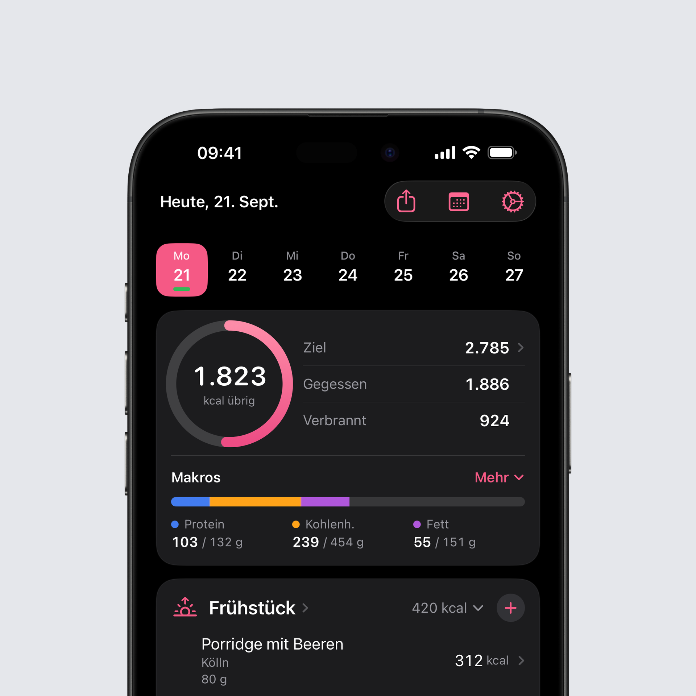
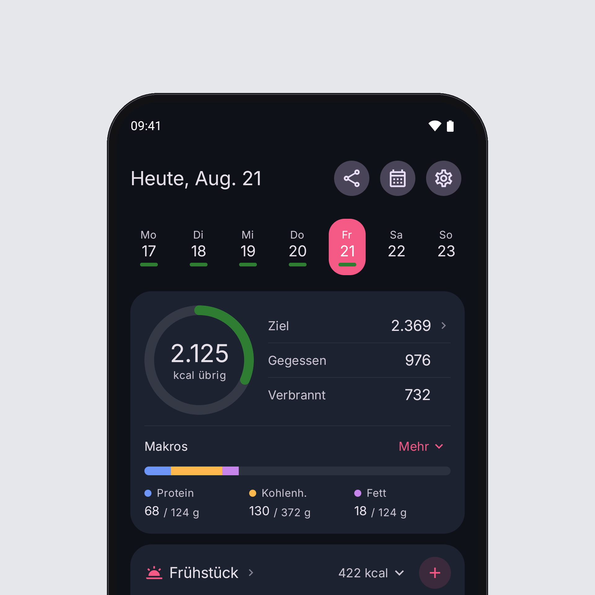

## Neu auf iOS: Heute sieht neu aus

Heute ist der Bildschirm, den du am häufigsten siehst, und er hatte über die Jahre viel Platz an sich gebunden. Diese Version ordnet ihn neu. Die Richtung habt ihr in einer Umfrage auf Threads ausgesucht.

**Der Tag auf einen Blick.** Der Kalorienring sitzt kompakt links, daneben stehen Ziel, Gegessen und Verbrannt untereinander. Ein Tipp auf Ziel öffnet weiterhin die Anpassung für diesen Tag. Darunter liegen die Makros als ein Balken mit Protein, Kohlenhydraten und Fett, jeweils mit ihrem Ziel. „Mehr“ klappt alle sieben auf und führt weiter zu jedem einzelnen Nährwert.

**Die Mahlzeiten.** Das Plus liegt jetzt in der Überschrift der Mahlzeit und funktioniert auch, wenn die Mahlzeit zugeklappt ist. Der Titel öffnet die Übersicht der Mahlzeit, die Summe klappt sie zu. Jeder Eintrag zeigt Name, Marke und Portion, und eine Schätzung von Intake AI trägt ihr Kennzeichen direkt in der Zeile.

**Drumherum.** Der Teilen-Button für den Tag ist nach oben in die Leiste gewandert, und die Auswahl in der Wochenleiste schiebt sich zu dem Tag, den du antippst.

## Neu auf Android: Heute sieht neu aus

Das neue Heute ist auch auf Android da, mit demselben Aufbau wie auf iOS: der Kalorienring links, daneben Ziel, Gegessen und Verbrannt, darunter die Makros als ein Balken mit drei Spalten. „Mehr“ klappt alle sieben Makros auf und führt zu allen Nährstoffen.

**Was auf Android anders ist.** Ein Tipp auf Ziel öffnet die tagesabhängigen Ziele in den Einstellungen, dort passt du einen einzelnen Tag oder einen Wochentag an. Ist der Tag angepasst, steht das Plus oder Minus direkt vor dem Ziel. Der Teilen-Button sitzt oben neben Datum und Einstellungen.

**Die Mahlzeiten.** Das runde Plus in der Überschrift trägt auch in eine zugeklappte Mahlzeit ein, der Titel öffnet die Übersicht, die Summe klappt zu. Eine Mahlzeit ohne Einträge zeigt das in ihrer Überschrift und nimmt keinen Platz darunter ein. Der große Hinzufügen-Button unter jeder Mahlzeit ist weg.

**Große Schrift.** Bei sehr großer Schrift stehen Ring, Makrospalten und der Titel der Mahlzeit untereinander, und Zahlen werden nie abgeschnitten.

## iPad und breite Bildschirme

Auf breiten Bildschirmen nutzt Intake den Platz jetzt wirklich. Heute steht in zwei Spalten, links der Tag mit Ring und Makros, rechts die Mahlzeiten. Die Bibliothek wird zu einer geteilten Ansicht, in der die Listen neben den Bereichen stehen, so wie du es von den Einstellungen des Systems kennst. Statistik wird zu einem Raster aus Karten, und Fasten bleibt in lesbarer Breite, statt sich über den ganzen Bildschirm zu ziehen.

## Bereit für das iPhone Duo

Zusammengeklappt ist Intake das gewohnte iPhone-Layout. Aufgeklappt nutzen Heute, Bibliothek und Statistik dieselben breiten Layouts wie auf dem iPad.

## Die Leiste von iOS 27

Unter iOS 27 übernimmt die Leiste des Systems mit dem großen Plus die Stelle der eigenen Leiste. Sie verhält sich so, wie du es aus anderen Apps kennst, und das Plus öffnet weiterhin das Hinzufügen. Unter iOS 26 bleibt alles, wie es ist.

## Siri trägt ein, was du sagst

Sag „Mein Gewicht in Intake eintragen“ oder „Lebensmittel in Intake eintragen“ und danach die Zahl. Siri versteht jetzt auch eine diktierte Kommazahl wie 84,3. Vorher hat sie bei einem Komma noch einmal gefragt, und das ging so weiter, bis man „Punkt“ gesagt hat. Beim Eintragen von Lebensmitteln kennt Siri außerdem die hundert zuletzt benutzten Lebensmittel aus deiner Bibliothek und fragt nach der Menge, statt immer 100 g zu nehmen.

## Tage wechseln

Das Wischen zwischen Tagen läuft ruhiger, ein Drehen des Geräts behält den Tag, auf dem du warst, und ein Tipp auf einen anderen Tag in der Wochenleiste ist schneller da. Intake liest dafür beim Wischen nicht mehr ganze Messreihen neu ein und baut den sichtbaren Tag nicht nach jedem Wisch neu auf.

## Neu auf Android: Rezept-Entwürfe

Ein neues Rezept, das du gerade anlegst, speichert Intake jetzt laufend auf deinem Gerät. Wird die App geschlossen, stürzt sie ab oder startet das Handy neu, steht beim nächsten Anlegen eines Rezepts alles wieder da: Name, Notizen, Portionen und Zutaten. Der Entwurf verschwindet, sobald du das Rezept speicherst oder das Verwerfen bestätigst. Beim Bearbeiten eines vorhandenen Rezepts gibt es keinen Entwurf, dort bleibt die gespeicherte Fassung bestehen.

## Fehlerbehebungen

### iOS

- **Die Wochenleiste bleibt auf dieser Woche.** Die Tagesleiste über Heute konnte um ein paar Tage verschoben oder gleich auf der nächsten Woche starten und blieb dann so stehen. Betroffen war vor allem, wer „Zwischen Tagen wischen“ ausgeschaltet hat. Die Leiste startet jetzt auf der aktuellen Woche, und wenn sie doch einmal verrutscht, rückt sie sich selbst zurecht. Die Woche wechselt nur noch, wenn du selbst wischst oder auf „Heute“ tippst.
- **Gelöschte Workouts verschwinden.** Ein Workout, das du in Garmin, Apple Health oder einer anderen App gelöscht hast, blieb in Intake stehen und zählte weiter zu deinen verbrannten Kalorien, auch in der Statistik. Intake gleicht jetzt mit Health ab, welche Workouts es noch gibt, und entfernt die anderen. Workouts, die du in Intake selbst eingetragen hast, bleiben unberührt.
- **Scanner im Querformat auf dem iPad.** Im Querformat war das Kamerabild des Barcode-Scanners um 90 Grad gedreht. Es folgt jetzt der Haltung des Geräts, auch in Split View, und Fotos für Intake AI kommen aufrecht an.
- **Wieder raus aus dem Scanner.** Hast du den Scanner direkt geöffnet, etwa über den Sperrbildschirm oder ein Widget, landetest du nach dem Zurück wieder im Scanner, immer und immer wieder. Die Lebensmittelansicht öffnet ihren Start jetzt nur einmal.
- Die Zeilen in der Teilen-Ansicht waren in der Akzentfarbe erschienen. Titel und Werte stehen wieder in den normalen Textfarben.
- **Ein Gewicht von Siri oder der Watch steht sofort da.** In der Statistik stand es sofort, die Karte auf Heute zeigte noch das alte, bis du Intake geschlossen und neu geöffnet hast. Sie aktualisiert sich jetzt, sobald das Gewicht ankommt, auch wenn du beim Sprechen gar nicht in der App warst.
- **Gescannte Produkte holen die Datenbank ein.** Ein Produkt, das beim ersten Scannen noch fehlte, blieb für immer die Kopie von Open Food Facts, auch wenn wir es längst aufgenommen hatten. Ein erneuter Scan fragt jetzt noch einmal nach und übernimmt die geprüften Werte.

### Android

- Barcode-Scanner: Ein Produkt, das in der Intake-Datenbank noch fehlt, endete nach dem Scannen im Nichts, obwohl der Barcode erkannt wurde. Intake fragt jetzt wie auf iOS zusätzlich direkt bei Open Food Facts nach und öffnet das Produkt. Solche Lücken werden anonym gemeldet, damit das Produkt in die Datenbank aufgenommen werden kann.
- Kennt wirklich niemand den Barcode, öffnet sich das Formular für ein neues Produkt, der Barcode ist schon eingetragen. Bisher blieb die Kamera offen, zeigte eine kleine englische Zeile und reagierte auf denselben Barcode nicht mehr.
- Portionen: Nennt ein Produkt eine Portionsgröße, zum Beispiel 15,4 g pro Riegel, bietet Intake sie jetzt als Portion an und wählt sie vor. Die eigene Menge startet bei 100 g, statt das Gewicht der Portion zu wiederholen. Hast du bei einem Produkt schon einmal eine eigene Menge eingetragen, bleibt diese gemerkt.
- Ein Lebensmittel aus den Vorschlägen bot nur „Eigene Menge“ an, während dasselbe Lebensmittel aus den Favoriten oder unter Häufig seine Portionen zeigte. Vorschläge bieten jetzt dieselben Portionen, zum Beispiel einen kleinen, mittleren oder großen Apfel oder eine Scheibe Brot.
- Health Connect: Schlug eine Synchronisierung fehl, stand in den Einstellungen „Health Connect-Berechtigungen sind erforderlich“, obwohl alle Berechtigungen erteilt waren. Sie erneut zu vergeben änderte nichts. Intake sagt jetzt, dass die Synchronisierung fehlgeschlagen ist.
- Health Connect: Ein einzelner Eintrag, den Intake nicht lesen kann, etwa ein Workout aus einer anderen App, hielt die gesamte Synchronisierung an. Schritte, Kalorien und alles andere werden jetzt trotzdem übernommen.
- Hält das Problem an, enthält „Debug-Daten exportieren“ unter Health-Connect-Aktivität jetzt den letzten Fehler. Schick mir die Datei, dann sehe ich, woran es liegt.
- Das Alter in der Übersicht der Einstellungen sprang an deinem Geburtstag nicht um. Es wird jetzt wie deine Kalorienziele aus dem Geburtsdatum berechnet.
- Intake AI: Ein sehr großes Foto, etwa aus einem 50-Megapixel-Modus, oder ein Foto, das sich nicht lesen ließ, konnte die App ohne Meldung beenden. Fotos werden jetzt nur so groß geladen wie nötig, und ein unlesbares Foto zeigt eine Fehlermeldung im Chat.
- Eine Portion unter einem Gramm, zum Beispiel eine Tablette mit 0,25 g, wurde als 1 g eingetragen, mit dem Vierfachen der Nährwerte. Sie zählt jetzt mit ihrem echten Gewicht, und das Produktformular nimmt beim Portionsgewicht zwei Nachkommastellen an.
- Der Name eines schnell angelegten Eintrags ließ sich nur beim ersten Bearbeiten ändern. Er lässt sich jetzt jederzeit ändern.
- Die Fasten-Benachrichtigung hat sich im Hintergrund jede Sekunde neu aufgebaut. Sie aktualisiert sich jetzt nur noch, wenn sich die angezeigte Minute ändert.

Das komplette Changelog findest du wie immer [hier](https://featurevoting.tobibechtold.dev/app/intake/changelog).

Vielen Dank, dass du Intake nutzt.

Tobi
