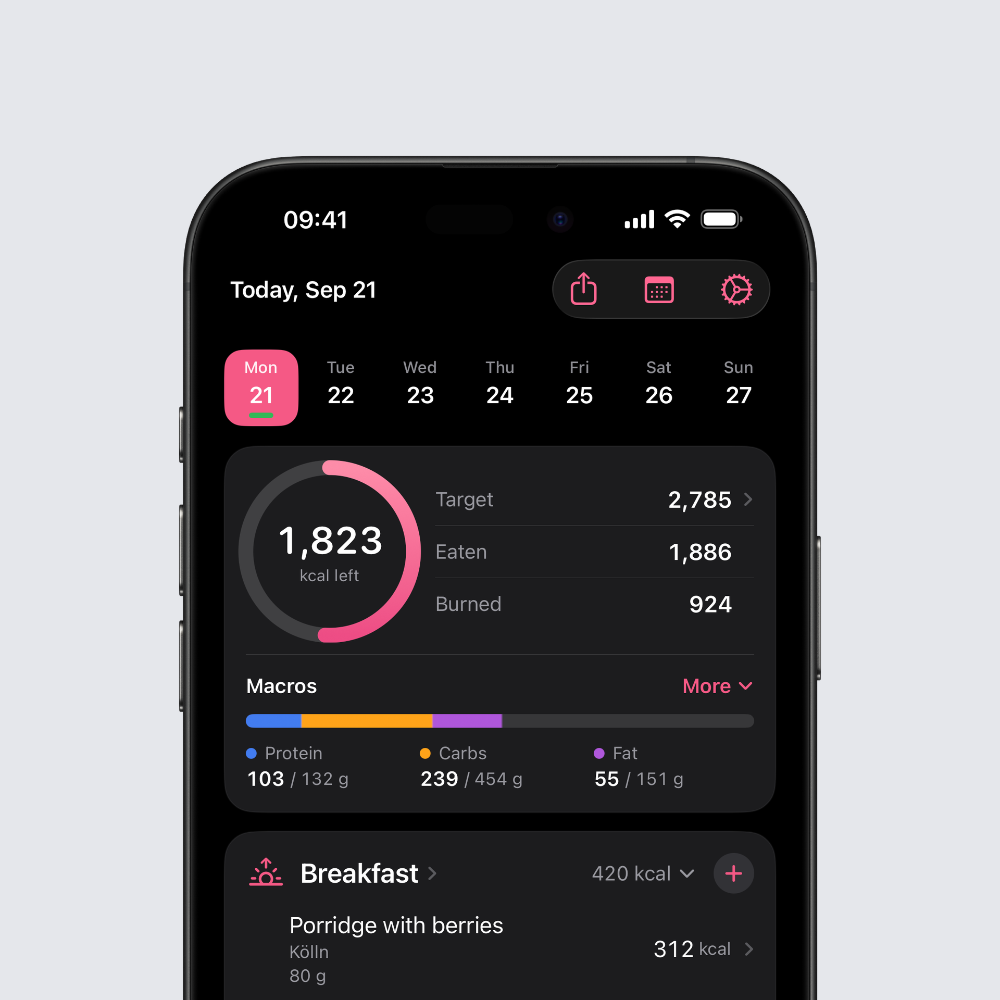
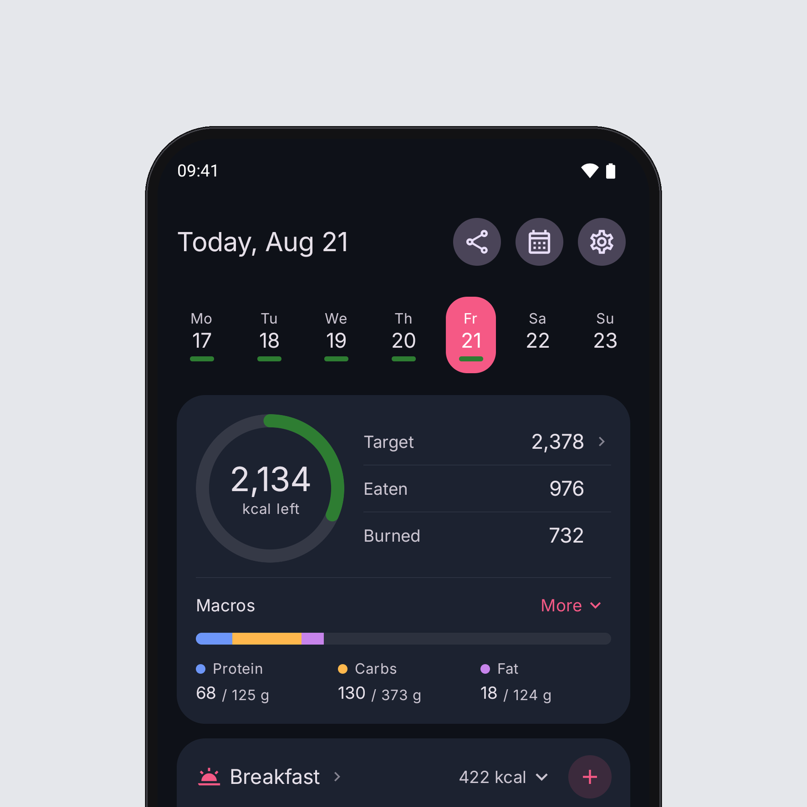

## New on iOS: Today has a new look

Today is the screen you see most often, and over the years it had claimed a lot of room. This version lays it out again. The community picked the direction in a poll on Threads.

**Your day at a glance.** The calorie ring sits compactly on the left, with Target, Eaten and Burned beside it, one under the other. Tapping Target still opens the adjustment for that day. Below them the macros are one bar with protein, carbs and fat, each with its target. More opens all seven and leads on to every single nutrient.

**Your meals.** The plus now sits in the meal's header and works while the meal is folded up. The title opens the meal overview, the total folds the meal away. Every entry shows its name, brand and portion, and an Intake AI estimate carries its badge right in the row.

**Around it.** The share button for the day has moved up into the toolbar, and the selection in the week strip slides over to the day you tap.

## New on Android: Today has a new look

The new Today is on Android too, laid out as on iOS: the calorie ring on the left, Target, Eaten and Burned beside it, and below them the macros as one bar with three columns. More opens all seven macros and leads on to every nutrient.

**What is different on Android.** Tapping Target opens the day-based targets in Settings, where you adjust a single day or a weekday. When the day is adjusted, the plus or minus stands right before the target. The share button sits at the top, next to date and settings.

**The meals.** The round plus in the header also adds to a collapsed meal, the title opens the overview, the total collapses it. A meal without entries says so in its header and takes no room below. The large add button under every meal is gone.

**Large text.** At very large text sizes the ring, the macro columns and the meal title stand one under the other, and numbers are never cut off.

## iPad and wide screens

On wide screens Intake now really uses the room. Today stands in two columns, the day with the ring and the macros on the left, the meals on the right. The Library becomes a split view with its lists beside the sections, the way you know it from the system's own settings. Stats turns into a grid of cards, and Fasting keeps a readable width instead of stretching across the whole screen.

## Ready for iPhone Duo

Folded, Intake is the iPhone layout you know. Opened, Today, Library and Stats use the same wide layouts as on iPad.

## The iOS 27 tab bar

On iOS 27 the system's own tab bar with its prominent plus takes the place of the custom one. It behaves the way you know it from other apps, and the plus still opens the add screen. On iOS 26 nothing changes.

## Moving between days

Swiping between days runs smoother, turning the device keeps the day you were on, and tapping another day in the week strip gets you there faster. While you swipe, Intake no longer re-reads whole measurement histories and no longer rebuilds the day you are looking at after every swipe.

## New on Android: recipe drafts

A new recipe you are putting together is now saved to your device as you go. If the app is closed, crashes or the phone restarts, everything is back the next time you create a recipe: name, notes, portions and ingredients. The draft goes away once you save the recipe or confirm discarding it. Editing an existing recipe has no draft; its saved version stays as it is.

## Bug fixes

### iOS

- **The week strip stays on this week.** The strip of days above Today could open a few days off, or straight on next week, and then stay that way. It mostly hit people who turned "Swipe between days" off. The strip now opens on the current week, and if it does slip, it puts itself right. The week only changes when you swipe it yourself or tap "Today".
- **Deleted workouts disappear.** A workout you deleted in Garmin, Apple Health or another app stayed in Intake and kept counting towards your burned calories, in the statistics too. Intake now checks with Health which workouts still exist and removes the others. Workouts you entered in Intake yourself are left alone.
- **Scanner in landscape on iPad.** With the iPad held sideways the barcode scanner's camera image was turned by 90 degrees. It now follows the way you hold the device, in Split View as well, and photos for Intake AI arrive upright.
- **Out of the scanner again.** Opened straight into the scanner, for instance from the Lock Screen or a widget, going back put you into the scanner again, over and over. The food view now opens its starting point once.
- The rows in the share gallery had turned into the accent colour. Titles and values are back in the normal text colours.
- English only: the water card said "+1 other beverages" for a single drink. It now says "+1 other beverage".

### Android

- A food opened from Suggestions offered a custom amount only, while the same food from Favourites or Frequent showed its portions. Suggestions now offer the same portions, for example a small, medium or large apple, or a slice of bread.
- Health Connect: when a sync failed, Settings said "Health Connect permissions are required" although every permission was granted, and granting them again changed nothing. Intake now says that the sync failed.
- Health Connect: a single record Intake cannot read, such as a workout from another app, stopped the whole sync. Steps, calories and everything else now come through anyway.
- If the problem persists, "Export debug data" under Health Connect activity now contains the last error. Send me the file and I can see what is wrong.
- Your age in the Settings overview did not change on your birthday. It is now calculated from your date of birth, like your calorie targets.
- Intake AI: a very large photo, for example from a 50-megapixel mode, or a photo that could not be read, could close the app without a message. Photos are now loaded only as large as needed, and an unreadable photo shows an error in the chat.
- A portion under one gram, for example a 0.25 g tablet, was logged as 1 g, with four times the nutrients. It now counts at its real weight, and the product form takes two decimals for a portion weight.
- The name of a quickly created entry could only be changed on its first edit. It can now be changed at any time.
- The fasting notification rebuilt itself every second in the background. It now only updates when the minute it shows changes.

You can find the full changelog [here](https://featurevoting.tobibechtold.dev/app/intake/changelog).

Thank you for using Intake.

Tobi
