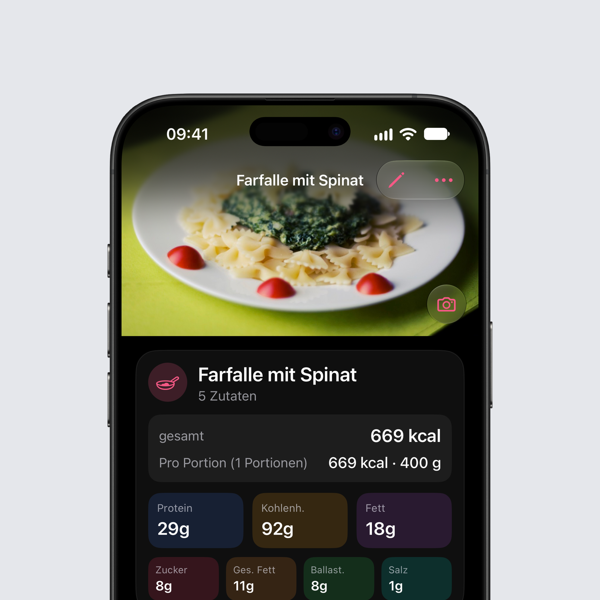

## Neu auf iOS: Fotos von deinem Essen

Jeder Eintrag, jedes eigene Produkt und jedes Rezept kann jetzt ein Foto haben. Tippe auf das Feld mit dem Foto-Symbol neben dem Namen und nimm ein Foto auf oder wähle eins aus deiner Mediathek. Für die Auswahl braucht Intake keinen Zugriff auf deine Mediathek, die Auswahl des Systems gibt nur das eine Foto weiter.

**Oben auf der Seite.** Öffnest du ein Lebensmittel mit Foto, steht das Foto oben über die ganze Breite, die Leiste liegt darüber. Ziehst du die Seite nach unten, wird das Foto größer, ein Tipp zeigt es im Vollbild. Über den Kamera-Button unten rechts auf dem Foto tauschst du es aus oder entfernst es.

**Auf Heute.** Einträge mit Foto zeigen es als kleines Bild am Anfang der Zeile. Ein Eintrag zeigt sein eigenes Foto, sonst das Foto des Produkts oder Rezepts, aus dem er stammt. So reicht ein Foto am Produkt für jeden künftigen Eintrag.

**Essen scannen.** Das Foto, mit dem Intake AI eine Mahlzeit geschätzt hat, bleibt jetzt dauerhaft beim Eintrag. Trägst du dieselbe Mahlzeit später wieder aus „Häufig“ oder einem Vorschlag ein, kommt das Foto mit. Kopierst du eine Mahlzeit auf einen anderen Tag, nehmen die Einträge ihre Fotos mit.

**Rezepte.** Rezepte zeigen ihr Foto in der Liste und oben im Rezept. Teilst du ein Rezept als Datei, reist das Foto mit, und wer es öffnet, bekommt es gleich dazu.

**Teilen.** „Bild teilen“ startet mit dem Foto des Lebensmittels, wenn es eines gibt.

**Auf allen Geräten.** Mit iCloud-Synchronisierung kommen die Fotos auf deine anderen Geräte, jedes als eigener Eintrag in deiner privaten iCloud. Unter Einstellungen, iCloud-Sync, lässt sich das Synchronisieren der Fotos pro Gerät ausschalten. Die Fotos gehen nur in deine iCloud, an keinen Server von Intake.

**Einstellungen.** Unter Einstellungen, Darstellung, Fotos schaltest du Fotos ganz ab, zeigst sie nur, wenn du ein Lebensmittel öffnest, oder blendest sie bei einzeln eingetragenen Zutaten einer Schätzung ein. Ausgeschaltete Fotos bleiben gespeichert.

## Ein Bericht, der sich lesen lässt

Der PDF-Export steht jetzt im Hochformat, mit jedem Eintrag jedes Tages, eigenen Makros pro Eintrag und den Summen vorne. Eine lange Mahlzeit geht auf der nächsten Seite mit ihrer Überschrift weiter, lange Namen stehen vollständig da, und alle Zahlen erscheinen im deutschen Format. Für einen Chat mit ChatGPT, Claude oder einer anderen KI gibt es denselben Bericht als Markdown.

## Tabletten und Nährwerte pro Portion

Portionen gehen bis 0,01 g hinunter, damit eine Tablette oder Kapsel ihr echtes Gewicht bekommt. Beim Anlegen eines Produkts kannst du die Werte jetzt pro Portion eingeben, pro Tablette oder pro Riegel, so wie sie auf der Packung stehen. Den Rest rechnet Intake aus.

## Fehlerbehebungen

### iOS

- **Die Wochenleiste zeigt die richtigen Daten.** Nach dem Wischen zu einer anderen Woche blitzte in einer Zelle kurz das alte Datum auf. Die Daten der neuen Woche stehen jetzt sofort da.
- **Ein neuer Tag um Mitternacht.** Bleibt Intake über Mitternacht offen oder kommst du am nächsten Morgen zurück, geht Heute auf den neuen Tag weiter. Schaust du dir gerade einen älteren Tag an, bleibst du dort.
- **Schnelleinträge in Gramm.** Einen Schnelleintrag kannst du auf Gramm ändern, und er bleibt in Gramm, wenn du die Getränke-Option ausschaltest.
- **Die passende Mahlzeit aus Kurzbefehlen.** Sperrbildschirm, Widgets und Siri tragen in die Mahlzeit ein, die zur Tageszeit passt. Auf der Produktseite wählst du bei Bedarf eine andere.
- **Deine Änderungen in Häufig.** Bearbeitest du ein Produkt aus „Häufig“, zeigt die Liste deine Werte. Bereits eingetragene Einträge bleiben, wie sie sind.
- **Deine Mahlzeiten auf jedem Gerät.** Selbst angelegte Mahlzeiten bleiben auf allen deinen Geräten erhalten.

Das komplette Changelog findest du wie immer [hier](https://featurevoting.tobibechtold.dev/app/intake/changelog).

Vielen Dank, dass du Intake nutzt.

Tobi
