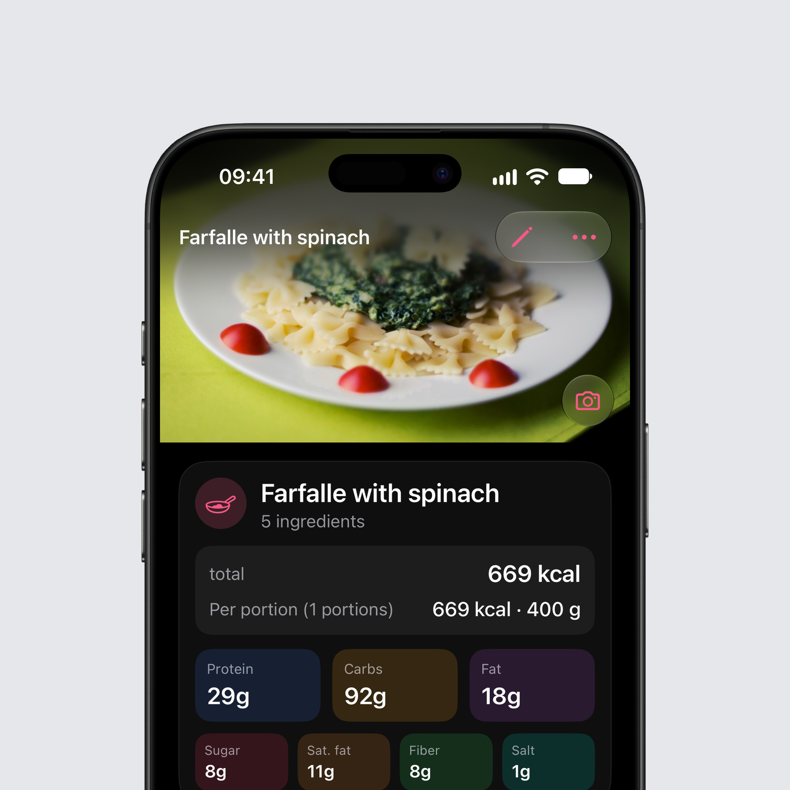

## New on iOS: photos of your food

Every entry, every product of your own and every recipe can now have a photo. Tap the square with the photo symbol next to the name and take a photo or choose one from your library. Choosing needs no access to your photo library: the system's picker hands over only the one photo.

**At the top of the page.** Open a food with a photo and the photo spans the top of the page, with the toolbar floating over it. Pull the page down and the photo grows; a tap shows it full screen. The camera button at its bottom right changes or removes it.

**On Today.** Entries with a photo show it as a small picture at the start of the row. An entry shows its own photo, otherwise the photo of the product or recipe it came from, so one photo on a product covers every future entry.

**Meal Scan.** The photo Intake AI estimated a meal from now stays with the entry for good. Log the same meal again later from Frequent or a suggestion and the photo comes along. Copy a meal to another day and its entries take their photos with them.

**Recipes.** Recipes show their photo in the list and at the top of the recipe. Share a recipe as a file and the photo travels with it; whoever opens it gets the photo too.

**Sharing.** "Share picture" starts with the food's photo when there is one.

**On every device.** With iCloud sync, photos reach your other devices, each as its own record in your private iCloud. In Settings, iCloud Sync, you can switch photo sync off per device. Photos only go to your iCloud, never to a server of Intake.

**Settings.** In Settings, Appearance, Photos you can switch photos off entirely, show them only when you open a food, or show them on the ingredients of an estimate logged one by one. Photos that are switched off stay stored.

## A report you can read

The PDF export is now in portrait, with every entry of every day, macros for each entry and the totals up front. A long meal continues on the next page with its heading, long names appear in full, and every number follows your language's format. For a chat with ChatGPT, Claude or another AI, the same report comes as Markdown.

## Tablets and nutrients per portion

Portions go down to 0.01 g, so a tablet or a capsule gets its real weight. When you create a product you can now enter the values per portion, per tablet or per bar, just as they are printed on the pack. Intake works out the rest.

## Bug fixes

### iOS

- **The week strip shows the right dates.** After swiping to another week, one cell briefly flashed the old date. The new week's dates are there straight away now.
- **A new day at midnight.** Keep Intake open past midnight or come back the next morning, and Today moves on to the new day. If you are looking at an older day, you stay there.
- **Quick entries in grams.** A quick entry can be changed to grams, and it stays in grams when you switch the drink option off.
- **The right meal from shortcuts.** The Lock Screen, widgets and Siri log into the meal that fits the time of day. On the product page you can pick another one.
- **Your edits in Frequent.** Edit a product from Frequent and the list shows your values. Entries you already logged stay as they are.
- **Your meals on every device.** Meals you added yourself stay on all your devices.

As always, you can find the complete changelog [here](https://featurevoting.tobibechtold.dev/app/intake/changelog).

Thank you for using Intake.

Tobi
